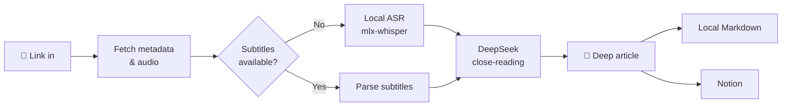

<div align="center">


# podcast-article

**Turn any podcast into an article worth keeping.**

Feed it a link, get back a deep, timestamped, Notion-ready article.

[简体中文](./README.md) · [English](./README.en.md)

    

</div>

---

## Why

Great podcasts are everywhere — but listening to everything is **low-density and forgettable**.

A 1-hour episode might contain 15 minutes of real insight; the great quotes and book mentions are gone from memory within a week.

podcast-article hands that job to the machine: local speech-to-text plus LLM close-reading produces a structured deep article — core arguments, chains of reasoning, quotable lines with jump-back timestamps, reading lists, and even a critical editor's note. **A 109-minute podcast becomes an article in ~4 minutes, for pennies.**

## ✨ Features

| | |
|---|---|
| 🌐 **Multi-source** | Xiaoyuzhou (no login) · YouTube · Bilibili · Apple Podcasts · RSS · local files |
| 🎧 **Local transcription** | mlx-whisper on Apple Silicon GPU, ~38× realtime; parses platform subtitles when available |
| 📝 **Deep writing** | No boring recap: logic-driven sections, facts vs. opinions, timestamped quotes, critical editorial notes |
| 📊 **Live progress** | Web UI with SSE push: download percentage, ASR progress & ETA, LLM characters generated |
| 📖 **Dedicated reading page** | Opening an article gives it a **full page of its own** (no sidebar, no composer), with a sticky header, a reading-progress line and a comfortable measure; the URL becomes `#/a/<folder>`, so refresh, bookmarks and shared links all reopen the same piece |
| ⏱ **Timestamp playback** | Both `[00:44:03]` and the quote-spanning `[00:06:36-00:06:49]` forms are clickable and play your **local audio** (ranges start at their beginning) — verify any claim on the spot |
| 🔎 **Full-text search** | Searches article bodies *and* transcripts, with context snippets and highlighting; timestamps in hits are directly playable |
| 🗂 **Library management** | Sidebar category folders with drag & drop filing; unread / reading / read / read-later states with one-click smart lists |
| 🖼 **Card covers** | Fetches each episode's artwork (YouTube / Bilibili thumbnails, podcast show art) and **downloads it locally**, so cards render even offline |
| 📦 **Export** | Per article: Markdown (with YAML front matter) / self-contained single-file HTML / plain transcript. Whole library: one-click zip |
| 🚚 **Batch queue** | Paste 20 links at once into a persistent queue; the daemon works through them. Closing the browser or restarting loses nothing |
| 🔔 **Feed subscriptions** | Subscribe to RSS / Apple Podcasts; new episodes are discovered on a schedule and queued automatically |
| 🤖 **Reading assistant** | Select any passage → a drawer explains it using the episode transcript (timestamped, click to replay) plus web results |
| 💰 **Visible cost** | Tokens, exact cost (official peak/off-peak price table) and cache hit rate per article |
| ☁️ **One-click Notion** | Markdown → native blocks (tables/quotes/inline styles), metadata auto-filled into database properties |
| 🔌 **MCP support** | Runs as an MCP server for Claude Desktop & friends — conversational access to everything |
| 💾 **Fully cached** | Every step lands on disk; rewriting the article never re-transcribes; downloads resume and retry |
| 📱 **Mobile ready** | Responsive layout that collapses into a drawer sidebar; `--host 0.0.0.0` for LAN access |

## 🔍 How it works



The article skeleton is fixed and tuned on dozens of real episodes: **custom title → one-line summary → TL;DR → core content (arguments + evidence + timestamped quotes) → notable quotes → books/people/concepts table → editor's notes** (critically assessing weak arguments and threads worth digging into).

Overly long transcripts automatically switch to a chunk-then-synthesize mode — timestamps preserved and verifiable throughout.

## 📖 What the article looks like

Not a summary, not reading notes — a piece you can **read in one sitting**. The skeleton is built around reading motivation:

| Part | Purpose |
|---|---|
| Title + one-line deck | The title promises concrete information and a hook; the deck states the core tension but **never spoils the ending** |
| Opening 2-3 paragraphs | Enter through a concrete scene, detail or number ("At dawn on 18 April 1906, a magnitude 7.9 earthquake flattened most of San Francisco in 47 seconds…"), never a list of conclusions |
| Body, 3-6 sections | Headings promise concrete information ("The 2,500 fish he named turned out not to exist") instead of vague ones ("Light and dark", "Another world"); 300-900 words per section, paragraphs under 200 characters |
| What you take away | 3-5 checkable judgements, things to try, or reusable frameworks — never "learned about X" |
| Editor's notes | 3 items: where the argument is weak or overgeneralised, and how the reader should weigh it |

Hard rules: quotes with timestamps appear inline (max 6, no duplicate "quotable lines" section); at least one verifiable concrete detail every 200 characters; the banned-phrase list lives in `podcast_article/summarize.py`.

### Before / after: the same opening, rewritten

**Before** (conclusions first — the body loses its reason to be read):

> [one-line deck stating the ending] + a 5-bullet "content overview" that tells the whole story before the article starts.

**After** (a scene, with the ending saved for later):

> At dawn on 18 April 1906, a magnitude 7.9 earthquake flattened most of San Francisco in 47 seconds; more than 3,000 people died. On the top floor of Stanford's science building, a thousand alcohol-filled specimen jars fell from their shelves and shattered across the floor. A tall scientist with a walrus moustache stood in the wreckage, bent down, picked up a sewing needle, threaded it, and stitched the name tags straight into the fishes' throats.
>
> His name was David Starr Jordan, Stanford's first president — the man who had named more than a fifth of all known fish.

### Three length modes

A mode controls **structure and depth** (section count, whether tables/quotes are included); the word count follows from the content:

| Mode | Structure | Measured (109-min interview) |
|---|---|---|
| Concise | 3 sections + takeaways | 1,800-2,800 chars / 4-6 min |
| Standard | 4 sections + editor's notes | 2,900-3,700 chars / 7-9 min |
| Deep | 5 sections + concepts table + quotes | ~6,000 chars / 12 min |

Length is **calculated, not begged for**: generation runs an outline → per-section → closing pipeline
(`outline.py`), where every section carries its own character budget and token ceiling — so the total is
predictable — across runs it lands within ±25% of the expected value
(previously single-pass output was 1.5-2× and highly variable).

> Three cheaper approaches were measured and rejected (recorded here so they aren't retried):
> ① asking the model to self-compress — it either strips concrete detail (density 7.2 → 1.0 per 1k chars) or echoes the input verbatim;
> ② capping `max_tokens` to force brevity — this truncates the body and deletes the takeaways and editor's notes entirely;
> ③ mechanically dropping sections — it removed the payoff section, hitting the word count while ruining the piece.
> Conclusion: length must be controlled by **structure**, and formatting discipline belongs to
> deterministic post-processing (`postprocess.py`: split long paragraphs, dedupe quotes, drop dangling
> fragments, normalise CJK punctuation, strip filler).

### Quality check

```bash
uv run python scripts/report_quality.py output/*/article.md
```

Reports filler density, longest paragraph, bullet ratio, specificity density, orphan timestamps and mixed-language leaks — used to verify that prompt changes actually make articles more readable.

## 🧠 Model & thinking mode

The default is **`deepseek-flash`**; switch to `deepseek-v4-pro` via Settings → "Article model" or `DEEPSEEK_MODEL` in `.env`.

| Model | Time (concise) | Specificity density | Quotes | Best for |
|---|---|---|---|---|
| `deepseek-flash` | ~30 s | 4.4 / 1k chars | 2 | default — fast and good |
| `deepseek-v4-pro` | ~84 s | **9.0 / 1k chars** | 5 | important episodes — richer prose and detail |

### Thinking mode is explicitly disabled everywhere

DeepSeek's [thinking mode](https://api-docs.deepseek.com/guides/thinking_mode/) is **on by default**
(effort defaults to `high`) and returns its chain of thought in `reasoning_content`. For this workload it
has to be turned off — every reason below is measured, not assumed:

- Given a 70k-character transcript in context, the model reasons for **5,000-7,700 characters**
  (~3,000-4,600 tokens) and frequently exhausts the token budget before writing any content at all,
  returning an **empty string** (which once produced a zero-length article)
- Reasoning grows with input size and has no ceiling, so a deterministic per-section budget
  ("400 characters for this section") can't be guaranteed
- The docs state that with thinking on, `temperature` / `top_p` **have no effect** — and per-section
  writing relies on controlled sampling to keep length and voice stable

Calls therefore pass `extra_body={"thinking": {"type": "disabled"}}`. To experiment with it, set
`THINKING = True` in `podcast_article/outline.py` and raise `THINKING_ALLOWANCE` above 8000.

> The trade-off: no thinking buys **predictable length and 2-3× the speed**, at some cost in complex
> judgement. That's exactly why `deepseek-v4-pro` stays in Settings — even with thinking off, it lands
> twice the specificity density of flash.

## 🚀 Quick start

### One-line installer (macOS / Linux / Windows)

```bash
# macOS / Linux
curl -fsSL https://raw.githubusercontent.com/KevinYe0725/podcast-article/main/scripts/install.sh | bash

# Windows (PowerShell; or download the repo and double-click scripts\install.bat)
powershell -ExecutionPolicy Bypass -c "irm https://raw.githubusercontent.com/KevinYe0725/podcast-article/main/scripts/install.ps1 | iex"
```

The script installs **uv** (Python runtime manager — no suitable system Python needed), fetches
**Python 3.12** with it, gets the code, runs `uv sync`, checks **ffmpeg** (tries to install it if
missing), writes `.env` (asks once for your DeepSeek key, skippable) and runs a smoke test. It never
touches your system Python or global packages.

```bash
bash scripts/install.sh --check      # dry run: check the environment only
bash scripts/install.sh --cn         # behind the GFW: dependencies via the Aliyun PyPI mirror
bash scripts/install.sh --no-ffmpeg  # leave ffmpeg alone
PA_DEEPSEEK_KEY=sk-xxx bash scripts/install.sh            # non-interactive
PA_GH_PROXY=https://ghproxy.net/ bash scripts/install.sh  # when github.com is unreachable
```

> **The ASR backend is picked per platform**: macOS Apple Silicon gets `mlx-whisper` (GPU, ~38x
> realtime); Linux / Windows get `faster-whisper` (CPU only — a 100-minute episode takes tens of
> minutes; platform subtitles skip ASR entirely).

### Manual install

```bash
git clone https://github.com/KevinYe0725/podcast-article.git
cd podcast-article

uv sync                # install deps (creates .venv); add --extra faster on Linux/Windows
brew install ffmpeg    # if not installed
cp .env.example .env   # fill in DEEPSEEK_API_KEY
```

First run:

```bash
uv run podcast-article "https://www.xiaoyuzhoufm.com/episode/xxxx"
```

> The transcription model downloads on first use (~1.5 GB). On flaky networks see [Troubleshooting](#-troubleshooting).

## 🖥 Three ways to use it

### 1. Web UI (recommended)

```bash
uv run python webapp.py    # open http://127.0.0.1:8787
```

Paste a link → a four-stage timeline advances in real time (download / ASR / LLM percentages and ETAs) and then **collapses into a one-line summary** (elapsed time / download size / segments / characters) that you can re-expand → the finished article **opens on its own full-page reading view** (header is just "back + show · title + this article's cost", with a reading-progress line on top; transcript can be shown **side by side**). Then pick a publish target and send it to Notion or any MCP tool.

> The reading page has its own URL: `http://127.0.0.1:8787/#/a/<folder>`. Bookmark a piece, share the link, refresh — you land on the same article. `Esc`, the browser back button, or the "←" in the header all return to the library, which is still exactly where you left it.

> **Paste several links at once**: when the input detects more than one URL the button turns into "Add to queue (N)" — they run in order in the background even after you close the tab.
>
> **Works on phones**: below 900px the sidebar collapses into a left drawer (menu button top-left), and the composer, article toolbar and queue/feed rows stack automatically; the reading page stays full-screen with a narrower measure, and text inputs are bumped to 16px so iOS Safari does not zoom the page on focus. Drag & drop filing stays a desktop interaction (on touch, use the card's settings icon or the category chip).
>
> **Paste a whole share message**: what Bilibili / Xiaoyuzhou / YouTube put on your clipboard is one sentence (`【title】https://www.bilibili.com/video/BV…`). Paste it as-is — only the link is used; titles, numbering, trailing periods and any surrounding prose are ignored, and punctuation stuck to the end of the URL is trimmed.

Quick reference for the main interactions:

| I want to… | How |
|---|---|
| Re-listen to a sentence | Click any `[00:44:03]` or `[00:06:36-00:06:49]` in the article or transcript (Enter / Space works too); a player slides up (draggable, ±15 s) |
| Go back to the library | "←" in the reading header, `Esc`, or the browser back button |
| Find something I heard before | Search box top-left: searches bodies *and* transcripts, hits are playable |
| File an article | Press and drag a card onto a sidebar folder (desktop), or tap the card's category chip / settings icon (works on touch too) |
| Track reading progress | Opening an article marks it "reading"; tap the status chip at the card's bottom-left to change it, or use the toolbar status menu |
| See only unread items | The four smart lists in the sidebar (All / Uncategorised / categories sit above them) |
| Get something out | Toolbar "Export ▾": Markdown (with metadata) / single-file HTML / plain transcript; "Export all" zips the library |
| Save up links | Paste many links on the home page, or subscribe to shows on the Subscriptions page |
| Paste a share message | Paste the whole sentence an app's Share button copied (`【title】https://…`) — only the link inside is used |
| Check what it cost | The usage pill in the top bar (click for the breakdown); each article shows its own measured cost |

**Delete**: the ✕ on a card removes a record, with two levels — "delete the whole record" (article + audio + transcript, and it tells you how much space is freed; an episode is often 50-200 MB) or "delete the article only" (keeps audio and transcript so it can be regenerated).

**Categories**: the library has a folder-style sidebar (All / Uncategorised / smart lists / your own categories, each with a count). Create one with "＋", then **press and drag a card onto a sidebar folder** to file it (works with mouse, trackpad and touch — the card follows your pointer and the target highlights). You can also click a card's category label and pick from a menu. Categories can be renamed or deleted (deleting one never deletes articles — they return to "Uncategorised"), and clicking a category filters the grid.

The **⚙ Settings** button (top right) manages your profile, credentials and generation preferences:

| Section | Contents |
|---|---|
| Profile | Name + long-term interests, injected into the writing prompt as a "reader profile" |
| API keys | DeepSeek / Notion — **write-only** (the API only ever reports whether a key is configured, plus a masked value), with one-click connection tests |
| Publish targets | Notion database / parent page ID |
| Generation defaults | Article model (flash / pro), default length mode, default language, ASR backend, ASR model, direct-read limit, force-ASR flag, auto-review |
| Subscriptions | Background check interval, whether new episodes auto-generate, which category they land in |
| MCP servers | See below |
| Storage & usage | Output directory and size, local models, config paths; cumulative tokens / cost / cache hit rate (broken down per model) |

> Leaving a credential field blank keeps the stored value — it can never be wiped by accident. New values are written into `.env` with existing comments preserved.

### 2. CLI

```bash
uv run podcast-article <url> [options]

--lang zh             # force transcription language (default: auto)
--no-subs             # force ASR, ignore platform subtitles
--force-transcript    # re-transcribe
--force-article       # regenerate article from existing transcript
--refresh             # redo everything
--pick 2              # pick the 2nd newest episode of an RSS feed
```

### 3. MCP

```bash
uv run podcast-article-mcp    # stdio transport
```

Add to your Claude Desktop (or any MCP client) config:

```json
{
  "mcpServers": {
    "podcast-article": {
      "command": "uv",
      "args": ["--directory", "/path/to/podcast-article", "run", "podcast-article-mcp"]
    }
  }
}
```

Four tools: `analyze_podcast` (full pipeline), `list_episodes`, `get_article`, `push_to_notion`.

## ☁️ Notion

1. Create an Internal Integration at [Notion Integrations](https://www.notion.so/profile/integrations), put its secret into `NOTION_TOKEN` in `.env`
2. In Notion, open the target page/database → "···" → Connections → add your integration
3. Set `NOTION_DATABASE_ID` (as a row) or `NOTION_PARENT_PAGE_ID` (as a sub-page) in `.env`

Page bodies are native Notion blocks: headings, quotes, lists, tables, inline styles, plus a source link at the end; database properties like "podcast / date / duration / source" are auto-filled.

## 🔌 Configure MCP servers in the UI

Settings → **"MCP servers"**. **Common servers are one click**, no forms to fill in:

| Button | What it does |
|---|---|
| **Notion official MCP** | One click. If no Notion token exists yet it asks for that single field; otherwise it reuses the one in `.env` instead of storing a second copy |
| **This project's MCP** | One click — exposes this project's capabilities to other AI clients |
| **Custom…** | Any stdio server: just one launch command (e.g. `npx -y @modelcontextprotocol/server-filesystem /tmp`), env vars optional |

After adding, the connection is **checked automatically** and the tool count is shown (no manual test button); the tool list stays collapsed until you expand it, and clicking any tool makes it the publish target. Config lives in `mcp_servers.json` (gitignored, may contain secrets) — you can also edit it directly; format: `mcp_servers.example.json`.

The **publish dropdown** above the article groups tools by server and floats page-creation / writing tools to the top with a ★:

```
Built-in Notion integration (REST)
MCP · notion (24 tools)   ★ API-post-page / ★ API-patch-block-children / …
MCP · podcast-article (4 tools)
```

Selecting an MCP tool reveals an **argument template** that maps article fields onto that tool's input:

```json
{
  "parent": { "database_id": "your-database-id" },
  "properties": {
    "标题": { "title": [{ "text": { "content": "{{title}}" } }] },
    "播客": { "rich_text": [{ "text": { "content": "{{podcast}}" } }] },
    "来源": { "url": "{{url}}" }
  },
  "children": "{{blocks}}"
}
```

Placeholders: `{{title}}` `{{podcast}}` `{{date}}` `{{duration}}` `{{url}}` `{{content}}` (full markdown) `{{blocks}}` (Notion block array, injected as JSON — feeds straight into `API-post-page`'s `children`). (Install the Notion MCP first: `npm i -g @notionhq/notion-mcp-server`.)

> The built-in Notion integration and the MCP route coexist: the former is a single REST call, the latter reuses the MCP ecosystem you already have configured elsewhere.

## 🗂 The library: search, status, export

An article isn't finished when it's generated — **what actually matters is finding it, finishing it, and getting it out.**

### Full-text search

It searches **article bodies *and* full transcripts**, not just titles. Hits come with a context snippet and highlighted keyword; when the hit is in the transcript, the timestamp on that line plays the audio — going from "I think he said something about this" to "found it and heard it" takes one click.

```
Search: "sewed the name onto the fish"

📄 49. Why Fish Don't Exist (David Starr Jordan)
   body        …chaos would come again, so what he [sewed onto the fish] had to survive…
   transcript  [00:44:03] …I sewed the name onto the fish just so I'd recognise it next time…  ← click to hear
```

Query syntax: space = all terms required; `|` = OR (`reinforcement learning|RL`); `"two words"` = one phrase.

### Reading status

Four states: **unread / reading / read / read later**. Opening an article advances it from unread to reading; the rest are manual (hover a card for shortcuts, or drag a card onto the matching sidebar row). The four smart lists are one-click filters, and they sit alongside your category folders:

```
Library                        ＋
🔍 Search articles and transcripts…
──────────────────────────────
☰ All articles              24
◷ Uncategorised              3
──────────────────────────────
● Unread                    11
● Reading                    2
● Read                       8
● Read later                 3
──────────────────────────────
📁 AI engineering            7
📁 Business interviews       4
＋ New category
──────────────────────────────
▤ Queue                     (3)
◎ Subscriptions             (2)
⚙ Settings
```

### Export

| Format | Use |
|---|---|
| Markdown (YAML front matter) | Drop into Obsidian / Logseq, or keep editing |
| Self-contained HTML | Inline styles, no external references — **safe to send to anyone** |
| Plain transcript | The raw timestamped transcript, for your own corpus |
| Library zip | Bundle everything at once (optionally with transcripts), filtered by the current category |

## 🚚 Batch queue & subscriptions

**Transcription is heavy local work** (a 100-minute episode takes over ten minutes), so the real workflow isn't babysitting one link at a time — it's "throw in everything I've saved up and collect articles later".

- **Batch**: paste many links on the home page and they queue up (stored in `queue.json` — closing the browser or restarting the server loses nothing). Reorder, delete individually, retry failures.
- **Subscriptions**: subscribe to RSS or Apple Podcasts feeds. A background check runs on your chosen interval, and new episodes are queued automatically (optionally filed into a category you pick).

> The queue runs **one episode at a time** (transcription saturates the GPU; concurrency just slows everything down), but you can close the page whenever.

There's one non-obvious design point for feed stability: enqueuing captures a **full snapshot of that episode** rather than "the 3rd episode in the feed". Feeds shift every time they update, so relative positions would silently redirect a queued job to a different episode.

## 🤖 Reading assistant: select what you don't understand, get it explained against the source

The place you get stuck while reading **shouldn't require opening a separate chat window** — that chat wouldn't know which episode or paragraph you're in. So the article view has a floating button:

```
① Select a passage you're unsure about
        ↓  a "✦ Dig into this" button appears
② Click it → the drawer slides in with the explanation
        ↓
③ Keep asking follow-ups (like any AI chat) — context carries over
        ↓
④ Expand the "evidence" line under an answer when you want to verify; timestamps play the audio
```

**It's a conversation**: keep asking follow-ups and the context carries over (in testing, a second question volunteered "what you asked before and what you're asking now are the same point"). Questions about the same passage form one thread; "＋ New chat" starts over.

**Evidence is collapsed by default** — under each answer there's just one line, "evidence: 6 passages · 5 web results", and you expand it when you want to check:

| Expanded | Contents |
|---|---|
| **Transcript evidence** | Passages retrieved from this episode's transcript, **each with a timestamp** — click to jump to that second in the audio and check the claim against the source |
| **Web results** | Real results from the built-in search layer (title / link / snippet), opening in a new tab |
| **Explanation** | Streamed, and **only answers what you asked** by default (120-320 characters, 1-3 paragraphs): what the passage means, where you might be stuck, and **what to chase next** |

**Length is a choice**, and the default is concise — that came from real use: the original 400-900 character version produced 914 characters across 7 blocks, of which **only one block answered the question asked**; the rest were points the model found interesting ("another thing worth noting is…", "this phrasing also deserves a pause"). So the problem wasn't just length, it was **answering the wrong question** — shrinking the word count alone doesn't fix it, the prompt has to forbid unprompted expansion. Tick "detailed" in the drawer to expand, or change the default in Settings.

**It answers — it doesn't narrate its sources**: no "the transcript doesn't cover this" or "the passages only mention A, B, C" (that's a waste of reading time). (Changed after user feedback: the old prompt actually *instructed* it to announce the absence first, so an entire paragraph went to inventorying the material.)

**The provenance tags are hidden too**: the model tags sentences with `（原文未提及）` / `（据网络资料）`, but those never appear in the answer — they're stripped and counted into the collapsed evidence line instead ("6 passages · 5 web results · 2 sentences flagged as non-transcript"). The wording is deliberately "model flagged": it's the model's own annotation, not an exhaustive check, so an absent count must not be read as "everything came from the transcript".

Also: ask directly without selecting anything, a per-episode Q&A history (stored in `qa.json` next to the article, so it is backed up and deleted with it), and a per-question toggle for web access.

### Why it ships its own search layer

**The DeepSeek API has no web search.** The official docs are explicit ([Responses API compatibility](https://api-docs.deepseek.com/guides/responses_api)):

| Tool type | Support |
|---|---|
| `function` (tool calls) | **Supported** |
| `custom` | `apply_patch` only |
| **`web_search` / `file_search` / `code_interpreter` / `computer_use` / `mcp`** | **Ignored** |

Even its own Responses API explicitly **ignores** the built-in `web_search` tool. So search has to be built here and fed back to the model:

- **Keyless by default**: Bing web search (via its RSS output, which is cleanly structured and needs no redirect decoding), falling back to Brave
- **Optional keys**: Tavily / Serper for better long-tail Chinese retrieval (Settings → Reading assistant, or `.env`)
- **Disable entirely**: `PA_SEARCH=0` — the assistant reads only the transcript and touches no network

### An honest limitation: irrelevant results are dropped, not fed to the model

Search engines index **long-tail Chinese proper nouns** poorly and degrade to matching a single character:

| Query | Bing's top results |
|---|---|
| `SGLang` | ✓ GitHub / docs / papers |
| `SGLang 朱邦华` | ✓ same (a **Latin term anchors the query**) |
| `朱邦华` | ✗ the dictionary entry for the character 朱 |
| `月球大叔 播客` | ✗ the encyclopedia entry for the Moon |

So two things follow: **the web query is short keywords, not the raw sentence** (Latin terms first, plus short intact CJK fragments — feeding the full sentence to a search engine returns exactly the garbage above); and **results are relevance-filtered**. When nothing survives, it reports "no web results this time" instead of handing "the dictionary entry for 朱" to the model. Better to say less than to let the AI weave an unrelated web page into an answer. The prompt likewise insists: anything the transcript didn't cover must be marked "**the transcript doesn't mention this — the following is background**", and no number that isn't in the provided passages may be invented.

## 💰 Cost

| Stage | How | Cost |
|---|---|---|
| Transcription | Local mlx-whisper | **Free** |
| Article writing | DeepSeek API | ~**a few cents** per 2-hour episode |

Cost isn't estimated, it's **recorded**: every call reads `prompt_tokens` / `prompt_cache_hit_tokens` / `completion_tokens` from the API's `usage`. Pricing follows DeepSeek's official table (CNY per million tokens) and is **time-of-day aware** (peak = Mon-Fri 09:00-12:00 and 14:00-18:00 Beijing time, at twice the off-peak rate):

| Model | Input (cache hit) | Input (cache miss) | Output |
|---|---|---|---|
| `deepseek-flash` | 0.02 / 0.04 | 1.0 / 2.0 | 4.0 / 8.0 |
| `deepseek-v4-pro` | 0.15 / 0.30 | 4.5 / 9.0 | 13.5 / 27.0 |

(off-peak / peak. Source: [api-docs.deepseek.com](https://api-docs.deepseek.com/quick_start/pricing) — check the official page for the latest.)

**Cache hits are what make this cheap**: section-by-section writing places the transcript as a fixed prefix at the front of every message, so DeepSeek's context cache hits it — cached input costs **1/50** of uncached input. That's why 8-12 calls don't bill the full transcript 8-12 times. The "cache hit rate" shown in the UI is the direct readout of that optimisation.

## 🛠 Environment variables

| Variable | Purpose |
|---|---|
| `PA_PORT` | Web port (default 8787) |
| `PA_OUTPUT_DIR` | Output root (default `./output`) |
| `PA_LIBRARY_FILE` | Categories and reading status (default `./library.json`) |
| `PA_QUEUE_FILE` / `PA_FEEDS_FILE` | Batch queue / subscriptions |
| `PA_SCHEDULER=0` | Disable the background scheduler (feed checks + queue execution) |
| `PA_DOWNLOAD_RETRIES` | Download retry count (default 3) |
| `PA_DOWNLOAD_BACKOFF` | Retry backoff seconds (default `2,5`) |
| `PA_SEARCH=0` | Disable the reading assistant's web search (transcript only) |
| `PA_SEARCH_PROVIDER` | Force a provider: `bing` / `brave` / `tavily` / `serper` |
| `TAVILY_API_KEY` / `SERPER_API_KEY` | Optional keyed providers (better long-tail Chinese retrieval) |
| `DEEPSEEK_API_KEY` / `DEEPSEEK_MODEL` | Credentials and model for article writing |

## 📱 LAN access & autostart

By default it listens on `127.0.0.1` only (**there is no authentication — never expose it to the public internet**). To use it from your phone:

```bash
uv run python webapp.py --host 0.0.0.0 --port 8787
# open http://<your-LAN-IP>:8787 on the phone
```

Narrow screens collapse into a drawer sidebar and a single-column layout. To keep it running on macOS (which also makes background feed checks work), use launchd:

```bash
cat > ~/Library/LaunchAgents/com.kevin.podcast-article.plist <<'PLIST'
<?xml version="1.0" encoding="UTF-8"?>
<!DOCTYPE plist PUBLIC "-//Apple//DTD PLIST 1.0//EN" "http://www.apple.com/DTDs/PropertyList-1.0.dtd">
<plist version="1.0"><dict>
  <key>Label</key><string>com.kevin.podcast-article</string>
  <key>WorkingDirectory</key><string>/ABSOLUTE/PATH/TO/podcast-article</string>
  <key>ProgramArguments</key>
  <array><string>/opt/homebrew/bin/uv</string><string>run</string><string>python</string>
    <string>webapp.py</string><string>--port</string><string>8787</string></array>
  <key>RunAtLoad</key><true/>
  <key>KeepAlive</key><true/>
  <key>StandardOutPath</key><string>/tmp/podcast-article.log</string>
  <key>StandardErrorPath</key><string>/tmp/podcast-article.err</string>
</dict></plist>
PLIST

# replace /ABSOLUTE/PATH/TO/podcast-article with the real path (use pwd), then:
launchctl load ~/Library/LaunchAgents/com.kevin.podcast-article.plist
```

## 🔧 Troubleshooting

<details>
<summary><b>Slow model download / SSL interruptions (common in some regions)</b></summary>

The huggingface_hub downloader can get connection-reset on some networks. Download manually and the tool picks it up automatically:

```bash
# 1. Get the commit
SHA=$(curl -sL "https://hf-mirror.com/api/models/mlx-community/whisper-large-v3-turbo-4bit" | python3 -c "import json,sys;print(json.load(sys.stdin)['sha'])")

# 2. Download (file must be named weights.safetensors)
D=~/.cache/podcast-article/models/whisper-large-v3-turbo-4bit
mkdir -p $D
curl -L -C - -o $D/weights.safetensors "https://huggingface.co/mlx-community/whisper-large-v3-turbo-4bit/resolve/$SHA/model.safetensors"
curl -L -o $D/multilingual.tiktoken "https://huggingface.co/mlx-community/whisper-large-v3-turbo-4bit/resolve/$SHA/multilingual.tiktoken"

# 3. Run with --model 4bit (or omit: local cache is preferred automatically)
```
</details>

<details>
<summary><b>Occasional SSL errors against the Notion API</b></summary>

Automatic retries (5×, exponential backoff) are built in. Persistent failures are network-level — retry later.
</details>

<details>
<summary><b>Xiaoyuzhou download speed fluctuates</b></summary>

Their CDN speed varies (1–7 min observed). Downloads now **resume and retry**: a dropped connection continues from the breakpoint with a `Range` header, and retryable errors back off and retry 3× (`PA_DOWNLOAD_RETRIES` / `PA_DOWNLOAD_BACKOFF`). A failed attempt leaves `audio.mp3.part` behind and the next run continues from there.
</details>

<details>
<summary><b>"Generate" seems to do nothing / "a task is already running"</b></summary>

**Only one pipeline runs at a time** (transcription saturates the GPU; concurrency only slows both down). When a job is already running the API returns 409, the UI tells you which link is running and reattaches to its progress — a page refresh doesn't lose it either (`/api/jobs/current`).
</details>

<details>
<summary><b>Subscriptions don't generate articles automatically</b></summary>

Automatic checks only happen while **`python webapp.py` is running as a daemon** (closing the browser is fine). Check three things: "background checks" is on in Settings → Subscriptions, the interval isn't 0, and you didn't start with `--no-scheduler`. You can always hit **Check now** on the Subscriptions page.
</details>

## ✅ Tests

```bash
uv run pytest tests/ -q        # backend: 522 tests
bash tests/ui/run.sh           # UI: jsdom against a real server (13 files)
```

| Scope | Coverage |
|---|---|
| Backend | Post-processing fixers, outline writing, category & reading-status store, queue, feeds, export, usage pricing, search, publish templates, MCP config, settings & `.env` semantics, every HTTP endpoint (including audio Range requests and path-traversal guards), background scheduler |
| UI | Reading page (full-screen layer, URL routing, deep-link restore), drag-to-categorise, drag-to-change-status, deleting records (both scopes), styled modals, closing articles with layered Esc, timestamp playback, full-text search & highlighting, batch enqueue, subscription management, export URLs |

Both suites run against **temporary directories and temporary data files**
(`PA_OUTPUT_DIR` / `PA_LIBRARY_FILE` / `PA_QUEUE_FILE` / `PA_FEEDS_FILE`) — your real `output/`
and personal data are never touched. CI lives in `.github/workflows/ci.yml` and runs both on every
push (Linux + Python 3.12).

> Note: `tests/ui/runview.test.js` needs a real download and transcription (network-dependent), so it
> stays out of CI and is run manually when needed.

## 📁 Project structure

```
podcast_article/
├── cli.py            # CLI entry
├── pipeline.py       # Orchestration + per-directory caching + download retry/resume
├── sources/          # Link resolution: Xiaoyuzhou / RSS / Apple / yt-dlp
├── subtitles.py      # Subtitle download & VTT/SRT parsing (rolling-dedup)
├── transcribe.py     # Local ASR + tqdm progress parsing
├── summarize.py      # DeepSeek close-reading & article generation (3 modes + prompts)
├── outline.py        # Outline + per-section writing (length-controlled)
├── postprocess.py    # Deterministic formatting pass (paragraphs/punctuation/filler)
├── usage.py          # Token & cost accounting (peak/off-peak pricing, cache hit rate)
├── cover.py          # Episode artwork: downloaded locally for the cards
├── deepdive.py       # Reading assistant: transcript retrieval (IDF) + prompt + streaming
├── websearch.py      # Self-built web search (keyless Bing/Brave + optional Tavily/Serper + relevance filter)
├── qa_store.py       # Per-episode Q&A history (lives next to the article)
├── search.py         # Full-text search (articles + transcripts, no index file)
├── library.py        # Categories and reading status
├── export.py         # Markdown / self-contained HTML / library zip export
├── queue.py          # Batch queue (persistent, reorderable, retryable)
├── feeds.py          # RSS subscriptions and new-episode discovery
├── notion.py         # markdown → Notion blocks (with retries)
├── mcp_server.py     # MCP server (stdio)
├── settings.py       # Settings store (profile / defaults / subscriptions / .env I/O)
├── mcp_config.py     # MCP server config store
├── mcp_client.py     # MCP stdio client
├── publish.py        # Publish dispatch (built-in Notion / any MCP tool)
├── config.py         # .env configuration
└── util.py           # Utilities

webapp.py             # Web server (Flask + SSE + audio Range stream + scheduler, port 8787)
web/index.html        # Page skeleton
web/app.js            # Frontend logic (no build step, no framework)
web/app.css           # Styles (OpenAI-style light theme, self-hosted Inter)

tests/                # pytest: backend and HTTP API
tests/ui/             # jsdom UI tests (harness.js is the shared skeleton)
```

## License

[MIT](./LICENSE) © 2026
