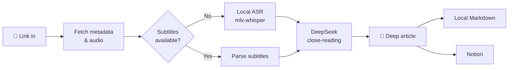

<div align="center">


# podcast-article

**Turn any podcast into an article worth keeping.**

Feed it a link, get back a deep, timestamped, Notion-ready article.

[简体中文](./README.md) · [English](./README.en.md)

    

</div>

---

## Why

Great podcasts are everywhere — but listening to everything is **low-density and forgettable**.

A 1-hour episode might contain 15 minutes of real insight; the great quotes and book mentions are gone from memory within a week.

podcast-article hands that job to the machine: local speech-to-text plus LLM close-reading produces a structured deep article — core arguments, chains of reasoning, quotable lines with jump-back timestamps, reading lists, and even a critical editor's note. **A 109-minute podcast becomes an article in ~4 minutes, for pennies.**

## ✨ Features

| | |
|---|---|
| 🌐 **Multi-source** | Xiaoyuzhou (no login) · YouTube · Bilibili · Apple Podcasts · RSS · local files |
| 🎧 **Local transcription** | mlx-whisper on Apple Silicon GPU, ~38× realtime; parses platform subtitles when available |
| 📝 **Deep writing** | No boring recap: logic-driven sections, facts vs. opinions, timestamped quotes, critical editorial notes |
| 📊 **Live progress** | Web UI with SSE push: download percentage, ASR progress & ETA, LLM characters generated |
| ☁️ **One-click Notion** | Markdown → native blocks (tables/quotes/inline styles), metadata auto-filled into database properties |
| 🔌 **MCP support** | Runs as an MCP server for Claude Desktop & friends — conversational access to everything |
| 💾 **Fully cached** | Every step lands on disk; rewriting the article never re-transcribes; interrupted runs resume |

## 🔍 How it works



The article skeleton is fixed and tuned on dozens of real episodes: **custom title → one-line summary → TL;DR → core content (arguments + evidence + timestamped quotes) → notable quotes → books/people/concepts table → editor's notes** (critically assessing weak arguments and threads worth digging into).

Overly long transcripts automatically switch to a chunk-then-synthesize mode — timestamps preserved and verifiable throughout.

## 🚀 Quick start

```bash
git clone https://github.com/KevinYe0725/podcast-article.git
cd podcast-article

uv sync                # install deps (creates .venv)
brew install ffmpeg    # if not installed
cp .env.example .env   # fill in DEEPSEEK_API_KEY
```

First run:

```bash
uv run podcast-article "https://www.xiaoyuzhoufm.com/episode/xxxx"
```

> The transcription model downloads on first use (~1.5 GB). On flaky networks see [Troubleshooting](#-troubleshooting).

## 🖥 Three ways to use it

### 1. Web UI (recommended)

```bash
uv run python webapp.py    # open http://127.0.0.1:8787
```

Paste a link → a four-stage timeline advances in real time (download / ASR / LLM percentages and ETAs) → read the article, with an optional **side-by-side transcript view**. Then pick a publish target and send it to Notion or any MCP tool.

The **⚙ Settings** button (top right) manages your profile, credentials and generation preferences:

| Section | Contents |
|---|---|
| Profile | Name + long-term interests, injected into the writing prompt as a "reader profile" |
| API keys | DeepSeek / Notion — **write-only** (the API only ever reports whether a key is configured, plus a masked value), with one-click connection tests |
| Publish targets | Notion database / parent page ID |
| Generation defaults | Default language, ASR backend, ASR model, direct-read limit, force-ASR flag |
| MCP servers | See below |
| Storage | Output directory, episode count and size, local models, config file paths |

> Leaving a credential field blank keeps the stored value — it can never be wiped by accident. New values are written into `.env` with existing comments preserved.

### 2. CLI

```bash
uv run podcast-article <url> [options]

--lang zh             # force transcription language (default: auto)
--no-subs             # force ASR, ignore platform subtitles
--force-transcript    # re-transcribe
--force-article       # regenerate article from existing transcript
--refresh             # redo everything
--pick 2              # pick the 2nd newest episode of an RSS feed
```

### 3. MCP

```bash
uv run podcast-article-mcp    # stdio transport
```

Add to your Claude Desktop (or any MCP client) config:

```json
{
  "mcpServers": {
    "podcast-article": {
      "command": "uv",
      "args": ["--directory", "/path/to/podcast-article", "run", "podcast-article-mcp"]
    }
  }
}
```

Four tools: `analyze_podcast` (full pipeline), `list_episodes`, `get_article`, `push_to_notion`.

## ☁️ Notion

1. Create an Internal Integration at [Notion Integrations](https://www.notion.so/profile/integrations), put its secret into `NOTION_TOKEN` in `.env`
2. In Notion, open the target page/database → "···" → Connections → add your integration
3. Set `NOTION_DATABASE_ID` (as a row) or `NOTION_PARENT_PAGE_ID` (as a sub-page) in `.env`

Page bodies are native Notion blocks: headings, quotes, lists, tables, inline styles, plus a source link at the end; database properties like "podcast / date / duration / source" are auto-filled.

## 🔌 Configure MCP servers in the UI

The **"MCP servers"** section of the Settings page configures any stdio MCP server — no config file editing:

1. Fill in name / command / args / env vars → **Add server**
2. Hit **Test** → the server is launched live and all its tools are listed (click a tool chip to make it the publish target)
3. The **publish dropdown** above the article then offers "Built-in Notion integration" plus every tool of every server
4. For MCP targets, use an **argument template** to map article fields onto that tool's input

Env values support `${VAR}` references to `.env`, so secrets are stored once. Config lives in `mcp_servers.json` (gitignored, may contain secrets); format: `mcp_servers.example.json`.

**Example: the official Notion MCP server**

```bash
npm i -g @notionhq/notion-mcp-server
```

In the UI: name `notion`, command `notion-mcp-server`, env `NOTION_TOKEN=${NOTION_TOKEN}`. Test should list 24 tools. Publish template (adjust property names to your database):

```json
{
  "parent": { "database_id": "your-database-id" },
  "properties": {
    "标题": { "title": [{ "text": { "content": "{{title}}" } }] },
    "播客": { "rich_text": [{ "text": { "content": "{{podcast}}" } }] },
    "来源": { "url": "{{url}}" }
  },
  "children": "{{blocks}}"
}
```

Placeholders: `{{title}}` `{{podcast}}` `{{date}}` `{{duration}}` `{{url}}` `{{content}}` (full markdown) `{{blocks}}` (Notion block array, injected as JSON — feeds straight into `API-post-page`'s `children`).

> The built-in Notion integration and the MCP route coexist: the former is a single REST call, the latter reuses the MCP ecosystem you already have configured elsewhere.

## 💰 Cost

| Stage | How | Cost |
|---|---|---|
| Transcription | Local mlx-whisper | **Free** |
| Article writing | DeepSeek API | ~**a few cents** per 2-hour episode |

## 🔧 Troubleshooting

<details>
<summary><b>Slow model download / SSL interruptions (common in some regions)</b></summary>

The huggingface_hub downloader can get connection-reset on some networks. Download manually and the tool picks it up automatically:

```bash
# 1. Get the commit
SHA=$(curl -sL "https://hf-mirror.com/api/models/mlx-community/whisper-large-v3-turbo-4bit" | python3 -c "import json,sys;print(json.load(sys.stdin)['sha'])")

# 2. Download (file must be named weights.safetensors)
D=~/.cache/podcast-article/models/whisper-large-v3-turbo-4bit
mkdir -p $D
curl -L -C - -o $D/weights.safetensors "https://huggingface.co/mlx-community/whisper-large-v3-turbo-4bit/resolve/$SHA/model.safetensors"
curl -L -o $D/multilingual.tiktoken "https://huggingface.co/mlx-community/whisper-large-v3-turbo-4bit/resolve/$SHA/multilingual.tiktoken"

# 3. Run with --model 4bit (or omit: local cache is preferred automatically)
```
</details>

<details>
<summary><b>Occasional SSL errors against the Notion API</b></summary>

Automatic retries (5×, exponential backoff) are built in. Persistent failures are network-level — retry later.
</details>

<details>
<summary><b>Xiaoyuzhou download speed fluctuates</b></summary>

Their CDN speed varies (1–7 min observed). Just re-run — nothing downloads twice.
</details>

## 📁 Project structure

```
podcast_article/
├── cli.py            # CLI entry
├── pipeline.py       # Orchestration + per-directory caching
├── sources/          # Link resolution: Xiaoyuzhou / RSS / Apple / yt-dlp
├── subtitles.py      # Subtitle download & VTT/SRT parsing (rolling-dedup)
├── transcribe.py     # Local ASR + tqdm progress parsing
├── summarize.py      # DeepSeek close-reading & article generation
├── notion.py         # markdown → Notion blocks (with retries)
├── mcp_server.py     # MCP server (stdio)
├── settings.py       # Settings store (profile / defaults / .env I/O)
├── mcp_config.py     # MCP server config store
├── mcp_client.py     # MCP stdio client
├── publish.py        # Publish dispatch (built-in Notion / any MCP tool)
├── config.py         # .env configuration
└── util.py           # Utilities

webapp.py             # Web server (Flask + SSE, port 8787)
web/index.html        # Single-file frontend (no build step, self-hosted Inter)
```

## License

[MIT](./LICENSE) © 2026
