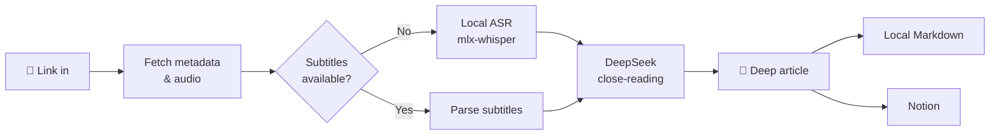

<div align="center">


# podcast-article

**Turn any podcast into an article worth keeping.**

Feed it a link, get back a deep, timestamped, Notion-ready article.

[简体中文](./README.md) · [English](./README.en.md)

    

</div>

---

## Why

Great podcasts are everywhere — but listening to everything is **low-density and forgettable**.

A 1-hour episode might contain 15 minutes of real insight; the great quotes and book mentions are gone from memory within a week.

podcast-article hands that job to the machine: local speech-to-text plus LLM close-reading produces a structured deep article — core arguments, chains of reasoning, quotable lines with jump-back timestamps, reading lists, and even a critical editor's note. **A 109-minute podcast becomes an article in ~4 minutes, for pennies.**

## ✨ Features

| | |
|---|---|
| 🌐 **Multi-source** | Xiaoyuzhou (no login) · YouTube · Bilibili · Apple Podcasts · RSS · local files |
| 🎧 **Local transcription** | mlx-whisper on Apple Silicon GPU, ~38× realtime; parses platform subtitles when available |
| 📝 **Deep writing** | No boring recap: logic-driven sections, facts vs. opinions, timestamped quotes, critical editorial notes |
| 📊 **Live progress** | Web UI with SSE push: download percentage, ASR progress & ETA, LLM characters generated |
| ☁️ **One-click Notion** | Markdown → native blocks (tables/quotes/inline styles), metadata auto-filled into database properties |
| 🔌 **MCP support** | Runs as an MCP server for Claude Desktop & friends — conversational access to everything |
| 💾 **Fully cached** | Every step lands on disk; rewriting the article never re-transcribes; interrupted runs resume |

## 🔍 How it works



The article skeleton is fixed and tuned on dozens of real episodes: **custom title → one-line summary → TL;DR → core content (arguments + evidence + timestamped quotes) → notable quotes → books/people/concepts table → editor's notes** (critically assessing weak arguments and threads worth digging into).

Overly long transcripts automatically switch to a chunk-then-synthesize mode — timestamps preserved and verifiable throughout.

## 📖 What the article looks like

Not a summary, not reading notes — a piece you can **read in one sitting**. The skeleton is built around reading motivation:

| Part | Purpose |
|---|---|
| Title + one-line deck | The title promises concrete information and a hook; the deck states the core tension but **never spoils the ending** |
| Opening 2-3 paragraphs | Enter through a concrete scene, detail or number ("At dawn on 18 April 1906, a magnitude 7.9 earthquake flattened most of San Francisco in 47 seconds…"), never a list of conclusions |
| Body, 3-6 sections | Headings promise concrete information ("The 2,500 fish he named turned out not to exist") instead of vague ones ("Light and dark", "Another world"); 300-900 words per section, paragraphs under 200 characters |
| What you take away | 3-5 checkable judgements, things to try, or reusable frameworks — never "learned about X" |
| Editor's notes | 3 items: where the argument is weak or overgeneralised, and how the reader should weigh it |

Hard rules: quotes with timestamps appear inline (max 6, no duplicate "quotable lines" section); at least one verifiable concrete detail every 200 characters; the banned-phrase list lives in `podcast_article/summarize.py`.

### Before / after: the same opening, rewritten

**Before** (conclusions first — the body loses its reason to be read):

> [one-line deck stating the ending] + a 5-bullet "content overview" that tells the whole story before the article starts.

**After** (a scene, with the ending saved for later):

> At dawn on 18 April 1906, a magnitude 7.9 earthquake flattened most of San Francisco in 47 seconds; more than 3,000 people died. On the top floor of Stanford's science building, a thousand alcohol-filled specimen jars fell from their shelves and shattered across the floor. A tall scientist with a walrus moustache stood in the wreckage, bent down, picked up a sewing needle, threaded it, and stitched the name tags straight into the fishes' throats.
>
> His name was David Starr Jordan, Stanford's first president — the man who had named more than a fifth of all known fish.

### Three length modes

A mode controls **structure and depth** (section count, whether tables/quotes are included); the word count follows from the content:

| Mode | Structure | Measured (109-min interview) |
|---|---|---|
| Concise | 3 sections + takeaways | 1,800-2,800 chars / 4-6 min |
| Standard | 4 sections + editor's notes | 2,900-3,700 chars / 7-9 min |
| Deep | 5 sections + concepts table + quotes | ~6,000 chars / 12 min |

Length is **calculated, not begged for**: generation runs an outline → per-section → closing pipeline
(`outline.py`), where every section carries its own character budget and token ceiling — so the total is
predictable — across runs it lands within ±25% of the expected value
(previously single-pass output was 1.5-2× and highly variable).

> Three cheaper approaches were measured and rejected (recorded here so they aren't retried):
> ① asking the model to self-compress — it either strips concrete detail (density 7.2 → 1.0 per 1k chars) or echoes the input verbatim;
> ② capping `max_tokens` to force brevity — this truncates the body and deletes the takeaways and editor's notes entirely;
> ③ mechanically dropping sections — it removed the payoff section, hitting the word count while ruining the piece.
> Conclusion: length must be controlled by **structure**, and formatting discipline belongs to
> deterministic post-processing (`postprocess.py`: split long paragraphs, dedupe quotes, drop dangling
> fragments, normalise CJK punctuation, strip filler).

### Quality check

```bash
uv run python scripts/report_quality.py output/*/article.md
```

Reports filler density, longest paragraph, bullet ratio, specificity density, orphan timestamps and mixed-language leaks — used to verify that prompt changes actually make articles more readable.

## 🧠 Model & thinking mode

The default is **`deepseek-flash`**; switch to `deepseek-v4-pro` via Settings → "Article model" or `DEEPSEEK_MODEL` in `.env`.

| Model | Time (concise) | Specificity density | Quotes | Best for |
|---|---|---|---|---|
| `deepseek-flash` | ~30 s | 4.4 / 1k chars | 2 | default — fast and good |
| `deepseek-v4-pro` | ~84 s | **9.0 / 1k chars** | 5 | important episodes — richer prose and detail |

### Thinking mode is explicitly disabled everywhere

DeepSeek's [thinking mode](https://api-docs.deepseek.com/guides/thinking_mode/) is **on by default**
(effort defaults to `high`) and returns its chain of thought in `reasoning_content`. For this workload it
has to be turned off — every reason below is measured, not assumed:

- Given a 70k-character transcript in context, the model reasons for **5,000-7,700 characters**
  (~3,000-4,600 tokens) and frequently exhausts the token budget before writing any content at all,
  returning an **empty string** (which once produced a zero-length article)
- Reasoning grows with input size and has no ceiling, so a deterministic per-section budget
  ("400 characters for this section") can't be guaranteed
- The docs state that with thinking on, `temperature` / `top_p` **have no effect** — and per-section
  writing relies on controlled sampling to keep length and voice stable

Calls therefore pass `extra_body={"thinking": {"type": "disabled"}}`. To experiment with it, set
`THINKING = True` in `podcast_article/outline.py` and raise `THINKING_ALLOWANCE` above 8000.

> The trade-off: no thinking buys **predictable length and 2-3× the speed**, at some cost in complex
> judgement. That's exactly why `deepseek-v4-pro` stays in Settings — even with thinking off, it lands
> twice the specificity density of flash.

## 🚀 Quick start

```bash
git clone https://github.com/KevinYe0725/podcast-article.git
cd podcast-article

uv sync                # install deps (creates .venv)
brew install ffmpeg    # if not installed
cp .env.example .env   # fill in DEEPSEEK_API_KEY
```

First run:

```bash
uv run podcast-article "https://www.xiaoyuzhoufm.com/episode/xxxx"
```

> The transcription model downloads on first use (~1.5 GB). On flaky networks see [Troubleshooting](#-troubleshooting).

## 🖥 Three ways to use it

### 1. Web UI (recommended)

```bash
uv run python webapp.py    # open http://127.0.0.1:8787
```

Paste a link → a four-stage timeline advances in real time (download / ASR / LLM percentages and ETAs) and then **collapses into a one-line summary** (elapsed time / download size / segments / characters) that you can re-expand → read the article, with an optional **side-by-side transcript view**. Then pick a publish target and send it to Notion or any MCP tool.

Each card in the history grid carries a **one-line deck** (so you can decide whether to open it) and a **takeaway preview**.

**Delete**: the ✕ on a card removes a record, with two levels — "delete the whole record" (article + audio + transcript, and it tells you how much space is freed; an episode is often 50-200 MB) or "delete the article only" (keeps audio and transcript so it can be regenerated).

**Categories**: the library has a folder-style sidebar (All / Uncategorised / your own categories, each with a count). Create one with "＋", then **press and drag a card onto a sidebar folder** to file it (works with mouse, trackpad and touch — the card follows your pointer and the target highlights). You can also click a card's category label and pick from a menu. Categories can be renamed or deleted (deleting one never deletes articles — they return to "Uncategorised"), and clicking a category filters the grid.

The **⚙ Settings** button (top right) manages your profile, credentials and generation preferences:

| Section | Contents |
|---|---|
| Profile | Name + long-term interests, injected into the writing prompt as a "reader profile" |
| API keys | DeepSeek / Notion — **write-only** (the API only ever reports whether a key is configured, plus a masked value), with one-click connection tests |
| Publish targets | Notion database / parent page ID |
| Generation defaults | Article model (flash / pro), default length mode, default language, ASR backend, ASR model, direct-read limit, force-ASR flag, auto-review |
| MCP servers | See below |
| Storage | Output directory, episode count and size, local models, config file paths |

> Leaving a credential field blank keeps the stored value — it can never be wiped by accident. New values are written into `.env` with existing comments preserved.

### 2. CLI

```bash
uv run podcast-article <url> [options]

--lang zh             # force transcription language (default: auto)
--no-subs             # force ASR, ignore platform subtitles
--force-transcript    # re-transcribe
--force-article       # regenerate article from existing transcript
--refresh             # redo everything
--pick 2              # pick the 2nd newest episode of an RSS feed
```

### 3. MCP

```bash
uv run podcast-article-mcp    # stdio transport
```

Add to your Claude Desktop (or any MCP client) config:

```json
{
  "mcpServers": {
    "podcast-article": {
      "command": "uv",
      "args": ["--directory", "/path/to/podcast-article", "run", "podcast-article-mcp"]
    }
  }
}
```

Four tools: `analyze_podcast` (full pipeline), `list_episodes`, `get_article`, `push_to_notion`.

## ☁️ Notion

1. Create an Internal Integration at [Notion Integrations](https://www.notion.so/profile/integrations), put its secret into `NOTION_TOKEN` in `.env`
2. In Notion, open the target page/database → "···" → Connections → add your integration
3. Set `NOTION_DATABASE_ID` (as a row) or `NOTION_PARENT_PAGE_ID` (as a sub-page) in `.env`

Page bodies are native Notion blocks: headings, quotes, lists, tables, inline styles, plus a source link at the end; database properties like "podcast / date / duration / source" are auto-filled.

## 🔌 Configure MCP servers in the UI

Settings → **"MCP servers"**. **Common servers are one click**, no forms to fill in:

| Button | What it does |
|---|---|
| **Notion official MCP** | One click. If no Notion token exists yet it asks for that single field; otherwise it reuses the one in `.env` instead of storing a second copy |
| **This project's MCP** | One click — exposes this project's capabilities to other AI clients |
| **Custom…** | Any stdio server: just one launch command (e.g. `npx -y @modelcontextprotocol/server-filesystem /tmp`), env vars optional |

After adding, the connection is **checked automatically** and the tool count is shown (no manual test button); the tool list stays collapsed until you expand it, and clicking any tool makes it the publish target. Config lives in `mcp_servers.json` (gitignored, may contain secrets) — you can also edit it directly; format: `mcp_servers.example.json`.

The **publish dropdown** above the article groups tools by server and floats page-creation / writing tools to the top with a ★:

```
Built-in Notion integration (REST)
MCP · notion (24 tools)   ★ API-post-page / ★ API-patch-block-children / …
MCP · podcast-article (4 tools)
```

Selecting an MCP tool reveals an **argument template** that maps article fields onto that tool's input:

```json
{
  "parent": { "database_id": "your-database-id" },
  "properties": {
    "标题": { "title": [{ "text": { "content": "{{title}}" } }] },
    "播客": { "rich_text": [{ "text": { "content": "{{podcast}}" } }] },
    "来源": { "url": "{{url}}" }
  },
  "children": "{{blocks}}"
}
```

Placeholders: `{{title}}` `{{podcast}}` `{{date}}` `{{duration}}` `{{url}}` `{{content}}` (full markdown) `{{blocks}}` (Notion block array, injected as JSON — feeds straight into `API-post-page`'s `children`). (Install the Notion MCP first: `npm i -g @notionhq/notion-mcp-server`.)

> The built-in Notion integration and the MCP route coexist: the former is a single REST call, the latter reuses the MCP ecosystem you already have configured elsewhere.

## 💰 Cost

| Stage | How | Cost |
|---|---|---|
| Transcription | Local mlx-whisper | **Free** |
| Article writing | DeepSeek API | ~**a few cents** per 2-hour episode |

## 🔧 Troubleshooting

<details>
<summary><b>Slow model download / SSL interruptions (common in some regions)</b></summary>

The huggingface_hub downloader can get connection-reset on some networks. Download manually and the tool picks it up automatically:

```bash
# 1. Get the commit
SHA=$(curl -sL "https://hf-mirror.com/api/models/mlx-community/whisper-large-v3-turbo-4bit" | python3 -c "import json,sys;print(json.load(sys.stdin)['sha'])")

# 2. Download (file must be named weights.safetensors)
D=~/.cache/podcast-article/models/whisper-large-v3-turbo-4bit
mkdir -p $D
curl -L -C - -o $D/weights.safetensors "https://huggingface.co/mlx-community/whisper-large-v3-turbo-4bit/resolve/$SHA/model.safetensors"
curl -L -o $D/multilingual.tiktoken "https://huggingface.co/mlx-community/whisper-large-v3-turbo-4bit/resolve/$SHA/multilingual.tiktoken"

# 3. Run with --model 4bit (or omit: local cache is preferred automatically)
```
</details>

<details>
<summary><b>Occasional SSL errors against the Notion API</b></summary>

Automatic retries (5×, exponential backoff) are built in. Persistent failures are network-level — retry later.
</details>

<details>
<summary><b>Xiaoyuzhou download speed fluctuates</b></summary>

Their CDN speed varies (1–7 min observed). Just re-run — nothing downloads twice.
</details>

## ✅ Tests

```bash
uv run pytest tests/ -q        # backend: post-processing fixers, category store, publish templates, MCP config, settings, HTTP API
bash tests/ui/run.sh           # UI: jsdom drives the real page against a real server, then shuts it down
```

UI tests cover real interactions (dispatched events, not mocked assertions): drag-to-categorise,
deleting records (both scopes), the styled modal, closing articles with layered Esc, and
**clicking a timestamp to replay the local audio**.

Both suites run against **temporary directories and a temporary library file**
(`PA_OUTPUT_DIR` / `PA_LIBRARY_FILE`) — your real `output/` and `library.json` are never touched.
CI lives in `.github/workflows/ci.yml` and runs both on every push.

> Note: `tests/ui/runview.test.js` needs a real download and transcription (network-dependent), so it
> stays out of CI and is run manually when needed.

## 📁 Project structure

```
podcast_article/
├── cli.py            # CLI entry
├── pipeline.py       # Orchestration + per-directory caching
├── sources/          # Link resolution: Xiaoyuzhou / RSS / Apple / yt-dlp
├── subtitles.py      # Subtitle download & VTT/SRT parsing (rolling-dedup)
├── transcribe.py     # Local ASR + tqdm progress parsing
├── summarize.py      # DeepSeek close-reading & article generation (3 modes + prompts)
├── outline.py        # Outline + per-section writing (length-controlled)
├── postprocess.py    # Deterministic formatting pass (paragraphs/punctuation/filler)
├── library.py        # Article categories and assignments
├── notion.py         # markdown → Notion blocks (with retries)
├── mcp_server.py     # MCP server (stdio)
├── settings.py       # Settings store (profile / defaults / .env I/O)
├── mcp_config.py     # MCP server config store
├── mcp_client.py     # MCP stdio client
├── publish.py        # Publish dispatch (built-in Notion / any MCP tool)
├── config.py         # .env configuration
└── util.py           # Utilities

webapp.py             # Web server (Flask + SSE, port 8787)
web/index.html        # Single-file frontend (no build step, self-hosted Inter)
```

## License

[MIT](./LICENSE) © 2026
