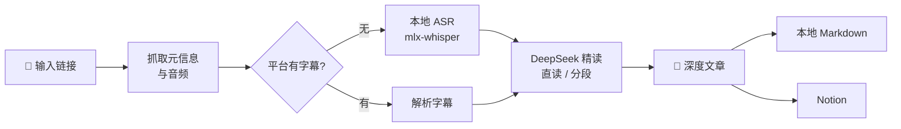

<div align="center">


# podcast-article

**把播客，变成值得收藏的文章。**

一条链接进去，一篇带时间戳、有观点、能进 Notion 的深度文章出来。

[简体中文](./README.md) · [English](./README.en.md)

    

</div>

---

## 为什么做这个

好播客很多，但**全量去听，信息密度太低，而且听完就会忘**。

1 小时的节目里真正有增量的可能只有 15 分钟；听到的好观点、好书名，一周后基本想不起来。

podcast-article 把这件事交给机器：本地语音转写 + LLM 精读，产出结构化的深度文章——核心论点、推理链条、金句（时间戳可回跳）、书影音清单、甚至编辑的批判性点评。**109 分钟的播客，约 4 分钟出稿，几分钱成本。**

## ✨ 特性

| | |
|---|---|
| 🌐 **多来源** | 小宇宙（免登录）· YouTube · Bilibili · Apple Podcasts · RSS · 本地文件 |
| 🎧 **本地转写** | mlx-whisper 走 Apple Silicon GPU，约 38 倍实时；平台有字幕时直接解析，零转写成本 |
| 📝 **深度成文** | 不做流水账复述：按逻辑重组章节、区分事实与观点、金句带时间戳、附编辑点评 |
| 📊 **实时进度** | Web 界面 SSE 推送：下载百分比、转写进度与剩余时间、LLM 已生成字数 |
| ☁️ **一键进 Notion** | markdown 转原生块（表格/引用/行内样式），元信息自动填入数据库属性 |
| 🔌 **MCP 支持** | 作为 MCP 服务器接入 Claude Desktop 等客户端，对话式调用全部能力 |
| 💾 **全程缓存** | 每步产物落盘，重新写文章不必重新转写，中断续跑 |

## 🔍 工作原理



文章骨架固定为六部分，经过数十期真实节目调校：**自拟标题 → 一句话总结 → 内容速览 → 核心内容（论点+论据+时间戳引用）→ 金句摘录 → 书影音/人物/概念表 → 编辑点评**（批判性评估论证薄弱处与值得深挖的点）。

超长文字稿自动切换「分段精读 → 汇总成文」，时间戳全程保留、可验证。

## 📖 文章长什么样

不是摘要，不是读书笔记，是一篇**能一口气读完**的文章。骨架按阅读动机设计：

| 部分 | 作用 |
|---|---|
| 标题 + 一句话引语 | 标题给出具体信息与钩子，引语只说核心张力，**不剧透结局** |
| 开篇 2-3 段 | 用具体场景/细节/数字切入（"1906 年 4 月 18 日清晨，旧金山发生里氏 7.9 级地震，47 秒内……"），不罗列结论 |
| 正文 3-6 节 | 小标题承诺具体信息（"他毕生命名的 2500 种鱼，被证明根本不存在"），而不是"光与暗""另一个世界"这类空泛标题；每节 300-900 字，段落不超过 200 字 |
| 读完你会带走什么 | 3-5 条可检验的判断、可试的做法、可复用的框架（不写"了解了 XX"） |
| 编辑点评 | 3 条：指出论证薄弱/以偏概全之处，并说明读者该怎么看待 |

硬约束：时间戳引用就地出现在行文中（不超过 6 条，不另设重复的"金句摘录"）；每 200 字至少一个可查证的具体细节；禁用语表见 `podcast_article/summarize.py`。

### 效果对比：同一个开头，改写前后

**改写前**（先给结论，正文失去阅读理由）：

> 斯坦福首任校长用一根针缝住混乱，作者追随他走出人生困境，却在最后发现——他毕生分类的鱼，根本不存在。
>
> **内容速览**
> - 主播孟岩因一本小众书《鱼不存在》断更许久，称它是自己的"年度之书"…
> - 书的主角是美国分类学家、斯坦福大学首任校长大卫·斯塔尔·乔丹：他在 1906 年旧金山大地震后…（5 条 bullet 把全书讲完）

**改写后**（场景切入，把结局留到最后）：

> 1906 年 4 月 18 日清晨，旧金山发生里氏 7.9 级地震，47 秒内城市大部分区域被夷为平地，3000 多人丧生。斯坦福大学科学楼顶层，上千个装满乙醇的标本罐从架子上砸下来，碎玻璃铺满地板。一位留着海象胡的高个子科学家站在废墟里，弯腰捡起一根缝衣针，穿上线，把写着鱼名的标牌直接缝进鱼的喉咙。
>
> 他叫大卫·斯塔尔·乔丹（David Starr Jordan），斯坦福大学首任校长，那个时代超过五分之一的已知鱼类由他命名。

### 三种篇幅档位

模式控制的是**结构与详略**（节数、是否含表格/金句），字数由内容量决定：

| 档位 | 结构 | 实测篇幅（109 分钟访谈） |
|---|---|---|
| 精华 | 3 节 + 带走清单 | 1800-2800 字 / 4-6 分钟 |
| 标准 | 4 节 + 编辑点评 | 2900-3700 字 / 7-9 分钟 |
| 深度 | 5 节 + 书影音表格 + 金句摘录 | 约 6000 字 / 12 分钟 |

篇幅是**算出来的**，不是求出来的：生成走「大纲 → 逐节写作 → 结尾栏目」流水线（`outline.py`），
每一节有独立的字数预算与 token 上限，所以总长可预测——多轮实测落在预期值的 ±25% 内
（原先单次生成是 1.5-2 倍且波动极大）。

> 我们试过三种更省事的写法，都被实测否掉了，记在这里免得重犯：
> ① 让模型自查压缩——它要么抽掉具体细节（密度 7.2 → 1.0/千字），要么原文照抄；
> ② 用 token 上限直接压字数——正文被截断，「带走什么」「编辑点评」整节消失；
> ③ 机械删节压字数——它删掉了全篇的高潮（「鱼不存在」那一节），字达标而文已废。
> 结论：篇幅要靠**结构**控制，格式纪律交给确定性后处理（`postprocess.py`：拆超长段落、
> 去重复引用、修残缺半句、规范中文标点、删套话）。

### 质量体检

```bash
uv run python scripts/report_quality.py output/*/article.md
```

输出套话密度、最长段落、bullet 占比、具体性密度、孤立时间戳、中英夹杂等指标——用来验证提示词改动是否真的让文章更好读。

## 🧠 模型与思考模式

默认使用 **`deepseek-flash`**；可在设置页「成文模型」或 `.env` 的 `DEEPSEEK_MODEL` 切换为 `deepseek-v4-pro`。

| 模型 | 精华档耗时 | 具体性密度 | 引用条数 | 适用 |
|---|---|---|---|---|
| `deepseek-flash` | 约 30 秒 | 4.4 / 千字 | 2 | 默认，够快够好 |
| `deepseek-v4-pro` | 约 84 秒 | **9.0 / 千字** | 5 | 重要节目，文笔与细节更足 |

### 思考模式：本项目全程显式关闭

DeepSeek 的[思考模式](https://api-docs.deepseek.com/zh-cn/guides/thinking_mode/)默认开启（effort 默认 `high`），
思维链通过 `reasoning_content` 字段返回。但在这个工作量下必须关掉，原因都是实测出来的：

- 把 7 万字文字稿放进上下文后，思考量会膨胀到 **5000-7700 字**（约 3000-4600 tokens），
  经常在还没开始写正文时就把 token 预算吃光，**正文返回空字符串**（我们因此一度整篇产出 0 字）
- 思考量随输入规模增长且没有上限，无法为「每节 400 字」这类确定性预算留出固定空间
- 文档明确：思考模式下 `temperature` / `top_p` 等参数**不生效**——而逐节写作正是靠可控的
  采样温度来稳定篇幅与文风的

因此调用时显式传 `extra_body={"thinking": {"type": "disabled"}}`。想尝试开启的话，把
`podcast_article/outline.py` 里的 `THINKING` 设为 `True`，并同步把 `THINKING_ALLOWANCE` 提到 8000 以上。

> 取舍：关闭思考换来**可控的篇幅与 2-3 倍的速度**，代价是复杂判断的质量略逊。
> 这也是把 `deepseek-v4-pro` 留在设置里的原因——它即使同样关闭思考，具体性密度仍是 flash 的两倍。

## 🚀 快速开始

```bash
git clone https://github.com/KevinYe0725/podcast-article.git
cd podcast-article

uv sync                # 安装依赖（自动创建 .venv）
brew install ffmpeg    # 如尚未安装
cp .env.example .env   # 填入 DEEPSEEK_API_KEY
```

跑第一条：

```bash
uv run podcast-article "https://www.xiaoyuzhoufm.com/episode/xxxx"
```

> 转写模型首次使用需下载（约 1.5GB）。国内网络遇到 SSL 中断时，见[故障排查](#-故障排查)。

## 🖥 三种用法

### 1. Web 界面（推荐）

```bash
uv run python webapp.py    # 打开 http://127.0.0.1:8787
```

粘贴链接 → 四阶段时间线实时推进（下载 / 转写 / 精读的百分比与剩余时间）→ 文章阅读视图，支持文章与文字稿**分栏对照**。写完选发布目标，一键投递到 Notion 或任意 MCP 工具。

右上角 **⚙ 设置** 里管理个人信息、密钥与生成偏好：

| 分区 | 内容 |
|---|---|
| 个人资料 | 称呼 + 长期关注方向，会作为「读者画像」注入成文提示词 |
| API 密钥 | DeepSeek / Notion，**只写不读**（接口只回报是否已配置 + 打码值），可一键测试连接 |
| 发布目标 | Notion 数据库 / 父页面 ID |
| 生成默认值 | 成文模型（flash / pro）、默认篇幅档位、默认转写语言、转写后端、ASR 模型、直读上限、是否强制转写、生成后是否复检 |
| MCP 服务器 | 见下节 |
| 存储 | 输出目录、已生成集数与占用、本地模型、配置文件路径 |

> 密钥字段留空即保持原值，不会被误清空；填写后写入 `.env`（保留原有注释）。

### 2. 命令行

```bash
uv run podcast-article <链接> [选项]

--lang zh             # 指定转写语言（默认自动检测）
--no-subs             # 强制语音转写，不用平台字幕
--force-transcript    # 重新转写
--force-article       # 同一文字稿重新生成文章
--refresh             # 全部重来
--pick 2              # RSS 输入时取第 2 新的单集
```

### 3. MCP 接入

```bash
uv run podcast-article-mcp    # stdio 传输
```

在 Claude Desktop 等客户端的配置里加入：

```json
{
  "mcpServers": {
    "podcast-article": {
      "command": "uv",
      "args": ["--directory", "/path/to/podcast-article", "run", "podcast-article-mcp"]
    }
  }
}
```

四个工具：`analyze_podcast`（跑完整流水线）、`list_episodes`、`get_article`、`push_to_notion`。

## ☁️ 写入 Notion

1. 在 [Notion Integrations](https://www.notion.so/profile/integrations) 创建 Internal Integration，拿到 Secret
2. 在 Notion 里打开目标页面/数据库 → 「···」→ 连接 → 添加你的 integration
3. 打开 Web 界面右上角 **⚙ 设置 → API 密钥** 粘贴 Token（或写入 `.env` 的 `NOTION_TOKEN`），点「测试连接」确认
4. **设置 → 发布目标** 填 `NOTION_DATABASE_ID`（作为一行）或 `NOTION_PARENT_PAGE_ID`（作为子页面）

页面正文是原生 Notion 块：标题层级、引用、列表、表格、行内样式，文末附原文链接；「播客 / 日期 / 时长 / 来源」等数据库属性自动填充。

## 🔌 在界面上配置 MCP 服务器

设置页 →「MCP 服务器」。**常见服务器点一下就配好**，不用填表：

| 按钮 | 行为 |
|---|---|
| **Notion 官方 MCP** | 一键添加。还没有 Notion Token 时只会问你这一个字段；`.env` 里已有就直接复用，不存第二份 |
| **本项目 MCP** | 一键添加，把本项目的分析能力开放给其他 AI 客户端 |
| **自定义…** | 任意 stdio 服务器，只需要一条启动命令（如 `npx -y @modelcontextprotocol/server-filesystem /tmp`），环境变量可选 |

添加后界面会**自动检测连接**并显示工具数量（无需手动点测试）；工具列表默认折叠，展开后点任意工具即可把它设为发布目标。配置落在 `mcp_servers.json`（已 gitignore，可含密钥），也可直接编辑，格式见 `mcp_servers.example.json`。

文章上方的**发布下拉框**按服务器分组，并把建页 / 写内容类工具排在前面标 ★：

```
内置 Notion 集成（REST）
MCP · notion（24 个工具）   ★ API-post-page / ★ API-patch-block-children / …
MCP · podcast-article（4 个工具）
```

选中 MCP 工具后会展开**参数模板**，把文章字段映射到该工具入参：

```json
{
  "parent": { "database_id": "你的数据库 ID" },
  "properties": {
    "标题": { "title": [{ "text": { "content": "{{title}}" } }] },
    "播客": { "rich_text": [{ "text": { "content": "{{podcast}}" } }] },
    "来源": { "url": "{{url}}" }
  },
  "children": "{{blocks}}"
}
```

可用占位符：`{{title}}` `{{podcast}}` `{{date}}` `{{duration}}` `{{url}}` `{{content}}`（markdown 全文）`{{blocks}}`（Notion 块数组，作为 JSON 注入，直接喂给 `API-post-page` 的 `children`）。（Notion MCP 需要先 `npm i -g @notionhq/notion-mcp-server`，国内可加 `--registry=https://registry.npmmirror.com`。）

> 内置 Notion 集成与 MCP 方式可以共存：前者一次调用完成（REST），后者可复用你已经在其他客户端里配好的 MCP 生态。

## 💰 成本

| 环节 | 方式 | 费用 |
|---|---|---|
| 语音转写 | 本地 mlx-whisper | **免费** |
| 精读成文 | DeepSeek API | 2 小时播客约 **几分钱** |

## 🔧 故障排查

<details>
<summary><b>转写模型下载慢 / SSL 中断（国内网络常见）</b></summary>

huggingface_hub 的下载器在部分网络下会被重置。手动把模型放到本地目录，工具自动识别：

```bash
# 1. 查 commit
SHA=$(curl -sL "https://hf-mirror.com/api/models/mlx-community/whisper-large-v3-turbo-4bit" | python3 -c "import json,sys;print(json.load(sys.stdin)['sha'])")

# 2. 下载（文件名必须是 weights.safetensors）
D=~/.cache/podcast-article/models/whisper-large-v3-turbo-4bit
mkdir -p $D
curl -L -C - -o $D/weights.safetensors "https://huggingface.co/mlx-community/whisper-large-v3-turbo-4bit/resolve/$SHA/model.safetensors"
curl -L -o $D/multilingual.tiktoken "https://huggingface.co/mlx-community/whisper-large-v3-turbo-4bit/resolve/$SHA/multilingual.tiktoken"

# 3. 运行：--model 4bit（也可不传，工具自动优先本地缓存）
```
</details>

<details>
<summary><b>Notion API 偶发 SSL 中断</b></summary>

已在代码内置自动重试（5 次、指数退避）。若仍失败，多为网络波动，稍后重试即可。
</details>

<details>
<summary><b>小宇宙音频下载速度波动</b></summary>

xyzcdn 的 CDN 速度不稳定（实测 1-7 分钟不等），失败重跑即可，已下载的部分不会重复下载。
</details>

## 📁 项目结构

```
podcast_article/
├── cli.py            # 命令行入口
├── pipeline.py       # 全流程编排 + 目录级缓存
├── sources/          # 链接解析：小宇宙 / RSS / Apple / yt-dlp
├── subtitles.py      # 平台字幕下载与 VTT/SRT 解析（滚动字幕去重）
├── transcribe.py     # 本地转写 + tqdm 进度解析
├── summarize.py      # DeepSeek 精读与文章生成（三档篇幅 + 提示词）
├── outline.py        # 大纲 + 逐节写作（篇幅可控的分节生成）
├── postprocess.py    # 确定性排版收尾（段落/标点/套话/时间戳/重复引用）
├── notion.py         # markdown → Notion blocks（带重试）
├── mcp_server.py     # MCP 服务器（stdio）
├── settings.py       # 设置存储（个人信息 / 默认值 / .env 读写）
├── mcp_config.py     # MCP 服务器配置存储
├── mcp_client.py     # MCP stdio 客户端
├── publish.py        # 发布分发（内置 Notion / 任意 MCP 工具）
├── config.py         # .env 配置
└── util.py           # 工具函数

webapp.py             # Web 服务（Flask + SSE，端口 8787）
web/index.html        # 前端单页（零构建，Inter 自托管）

scripts/
├── report_quality.py # 文章可读性体检（套话/段落/密度等指标）
└── make_banner.py    # 生成宣传海报
```

## License

[MIT](./LICENSE) © 2026
