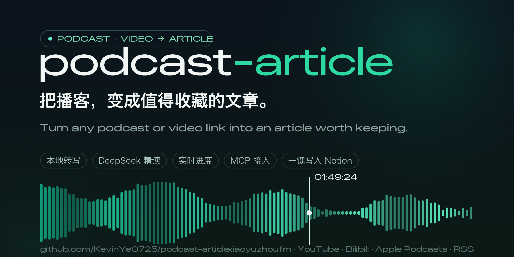
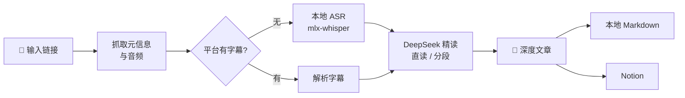

<div align="center">



# podcast-article

**把播客，变成值得收藏的文章。**

一条链接进去，一篇带时间戳、有观点、能进 Notion 的深度文章出来。

[简体中文](./README.md) · [English](./README.en.md)

    

</div>

---

## 为什么做这个

好播客很多，但**全量去听，信息密度太低，而且听完就会忘**。

1 小时的节目里真正有增量的可能只有 15 分钟；听到的好观点、好书名，一周后基本想不起来。

podcast-article 把这件事交给机器：本地语音转写 + LLM 精读，产出结构化的深度文章——核心论点、推理链条、金句（时间戳可回跳）、书影音清单、甚至编辑的批判性点评。**109 分钟的播客，约 4 分钟出稿，几分钱成本。**

## ✨ 特性

| | |
|---|---|
| 🌐 **多来源** | 小宇宙（免登录）· YouTube · Bilibili · Apple Podcasts · RSS · 本地文件 |
| 🎧 **本地转写** | mlx-whisper 走 Apple Silicon GPU，约 38 倍实时；平台有字幕时直接解析，零转写成本 |
| 📝 **深度成文** | 不做流水账复述：按逻辑重组章节、区分事实与观点、金句带时间戳、附编辑点评 |
| 📊 **实时进度** | Web 界面 SSE 推送：下载百分比、转写进度与剩余时间、LLM 已生成字数 |
| ☁️ **一键进 Notion** | markdown 转原生块（表格/引用/行内样式），元信息自动填入数据库属性 |
| 🔌 **MCP 支持** | 作为 MCP 服务器接入 Claude Desktop 等客户端，对话式调用全部能力 |
| 💾 **全程缓存** | 每步产物落盘，重新写文章不必重新转写，中断续跑 |

## 🔍 工作原理



文章骨架固定为六部分，经过数十期真实节目调校：**自拟标题 → 一句话总结 → 内容速览 → 核心内容（论点+论据+时间戳引用）→ 金句摘录 → 书影音/人物/概念表 → 编辑点评**（批判性评估论证薄弱处与值得深挖的点）。

超长文字稿自动切换「分段精读 → 汇总成文」，时间戳全程保留、可验证。

## 🚀 快速开始

```bash
git clone https://github.com/KevinYe0725/podcast-article.git
cd podcast-article

uv sync                # 安装依赖（自动创建 .venv）
brew install ffmpeg    # 如尚未安装
cp .env.example .env   # 填入 DEEPSEEK_API_KEY
```

跑第一条：

```bash
uv run podcast-article "https://www.xiaoyuzhoufm.com/episode/xxxx"
```

> 转写模型首次使用需下载（约 1.5GB）。国内网络遇到 SSL 中断时，见[故障排查](#-故障排查)。

## 🖥 三种用法

### 1. Web 界面（推荐）

```bash
uv run python webapp.py    # 打开 http://127.0.0.1:8787
```

粘贴链接 → 四阶段时间线实时推进（下载 / 转写 / 精读的百分比与剩余时间）→ 文章阅读视图，支持文章与文字稿**分栏对照**。写完点一下「✦ 写入 Notion」。

### 2. 命令行

```bash
uv run podcast-article <链接> [选项]

--lang zh             # 指定转写语言（默认自动检测）
--no-subs             # 强制语音转写，不用平台字幕
--force-transcript    # 重新转写
--force-article       # 同一文字稿重新生成文章
--refresh             # 全部重来
--pick 2              # RSS 输入时取第 2 新的单集
```

### 3. MCP 接入

```bash
uv run podcast-article-mcp    # stdio 传输
```

在 Claude Desktop 等客户端的配置里加入：

```json
{
  "mcpServers": {
    "podcast-article": {
      "command": "uv",
      "args": ["--directory", "/path/to/podcast-article", "run", "podcast-article-mcp"]
    }
  }
}
```

四个工具：`analyze_podcast`（跑完整流水线）、`list_episodes`、`get_article`、`push_to_notion`。

## ☁️ 写入 Notion

1. 在 [Notion Integrations](https://www.notion.so/profile/integrations) 创建 Internal Integration，把 Secret 填入 `.env` 的 `NOTION_TOKEN`
2. 在 Notion 里打开目标页面/数据库 → 「···」→ 连接 → 添加你的 integration
3. `.env` 配置 `NOTION_DATABASE_ID`（作为一行）或 `NOTION_PARENT_PAGE_ID`（作为子页面）

页面正文是原生 Notion 块：标题层级、引用、列表、表格、行内样式，文末附原文链接；「播客 / 日期 / 时长 / 来源」等数据库属性自动填充。

## 🔌 在界面上配置 MCP 服务器

Web 界面底部的 **「MCP 服务器」** 面板可以直接配置任意 MCP 服务器（stdio），不用改配置文件：

1. 填「名称 / 启动命令 / 参数 / 环境变量」→ **添加服务器**
2. 点 **测试** → 实时启动该服务器并列出它的全部工具（点工具胶囊即可把它选为发布目标）
3. 文章下方的**发布下拉框**里就会出现「内置 Notion 集成」+ 各服务器的工具
4. 选中 MCP 工具后，用**参数模板**把文章字段映射到该工具的入参

环境变量的值支持 `${VAR}` 引用 `.env`，所以密钥不用存两份。配置落在 `mcp_servers.json`（已 gitignore，可含密钥），格式见 `mcp_servers.example.json`。

**示例：接入 Notion 官方 MCP Server**

```bash
npm i -g @notionhq/notion-mcp-server    # 国内可加 --registry=https://registry.npmmirror.com
```

界面上填：名称 `notion`、命令 `notion-mcp-server`、环境变量 `NOTION_TOKEN=${NOTION_TOKEN}`，点测试应出现 24 个工具。发布模板（属性名按你的数据库调整）：

```json
{
  "parent": { "database_id": "你的数据库 ID" },
  "properties": {
    "标题": { "title": [{ "text": { "content": "{{title}}" } }] },
    "播客": { "rich_text": [{ "text": { "content": "{{podcast}}" } }] },
    "来源": { "url": "{{url}}" }
  },
  "children": "{{blocks}}"
}
```

可用占位符：`{{title}}` `{{podcast}}` `{{date}}` `{{duration}}` `{{url}}` `{{content}}`（markdown 全文）`{{blocks}}`（Notion 块数组，作为 JSON 注入，直接喂给 `API-post-page` 的 `children`）。

> 内置 Notion 集成与 MCP 方式可以共存：前者一次调用完成（REST），后者可复用你已经在其他客户端里配好的 MCP 生态。

## 💰 成本

| 环节 | 方式 | 费用 |
|---|---|---|
| 语音转写 | 本地 mlx-whisper | **免费** |
| 精读成文 | DeepSeek API | 2 小时播客约 **几分钱** |

## 🔧 故障排查

<details>
<summary><b>转写模型下载慢 / SSL 中断（国内网络常见）</b></summary>

huggingface_hub 的下载器在部分网络下会被重置。手动把模型放到本地目录，工具自动识别：

```bash
# 1. 查 commit
SHA=$(curl -sL "https://hf-mirror.com/api/models/mlx-community/whisper-large-v3-turbo-4bit" | python3 -c "import json,sys;print(json.load(sys.stdin)['sha'])")

# 2. 下载（文件名必须是 weights.safetensors）
D=~/.cache/podcast-article/models/whisper-large-v3-turbo-4bit
mkdir -p $D
curl -L -C - -o $D/weights.safetensors "https://huggingface.co/mlx-community/whisper-large-v3-turbo-4bit/resolve/$SHA/model.safetensors"
curl -L -o $D/multilingual.tiktoken "https://huggingface.co/mlx-community/whisper-large-v3-turbo-4bit/resolve/$SHA/multilingual.tiktoken"

# 3. 运行：--model 4bit（也可不传，工具自动优先本地缓存）
```
</details>

<details>
<summary><b>Notion API 偶发 SSL 中断</b></summary>

已在代码内置自动重试（5 次、指数退避）。若仍失败，多为网络波动，稍后重试即可。
</details>

<details>
<summary><b>小宇宙音频下载速度波动</b></summary>

xyzcdn 的 CDN 速度不稳定（实测 1-7 分钟不等），失败重跑即可，已下载的部分不会重复下载。
</details>

## 📁 项目结构

```
podcast_article/
├── cli.py            # 命令行入口
├── pipeline.py       # 全流程编排 + 目录级缓存
├── sources/          # 链接解析：小宇宙 / RSS / Apple / yt-dlp
├── subtitles.py      # 平台字幕下载与 VTT/SRT 解析（滚动字幕去重）
├── transcribe.py     # 本地转写 + tqdm 进度解析
├── summarize.py      # DeepSeek 精读与文章生成
├── notion.py         # markdown → Notion blocks（带重试）
├── mcp_server.py     # MCP 服务器（stdio）
├── config.py         # .env 配置
└── util.py           # 工具函数

webapp.py             # Web 服务（Flask + SSE，端口 8787）
web/index.html        # 前端单页（零构建，Inter 自托管）
```

## License

[MIT](./LICENSE) © 2026
