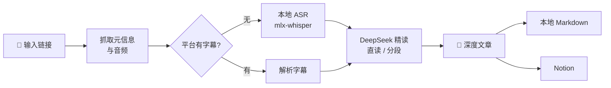

<div align="center">


# podcast-article

**把播客，变成值得收藏的文章。**

一条链接进去，一篇带时间戳、有观点、能进 Notion 的深度文章出来。

[简体中文](./README.md) · [English](./README.en.md)

    

</div>

---

## 为什么做这个

好播客很多，但**全量去听，信息密度太低，而且听完就会忘**。

1 小时的节目里真正有增量的可能只有 15 分钟；听到的好观点、好书名，一周后基本想不起来。

podcast-article 把这件事交给机器：本地语音转写 + LLM 精读，产出结构化的深度文章——核心论点、推理链条、金句（时间戳可回跳）、书影音清单、甚至编辑的批判性点评。**109 分钟的播客，约 4 分钟出稿，几分钱成本。**

## ✨ 特性

| | |
|---|---|
| 🌐 **多来源** | 小宇宙（免登录）· YouTube · Bilibili · Apple Podcasts · RSS · 本地文件 |
| 🎧 **本地转写** | mlx-whisper 走 Apple Silicon GPU，约 38 倍实时；平台有字幕时直接解析，零转写成本 |
| 📝 **深度成文** | 不做流水账复述：按逻辑重组章节、区分事实与观点、金句带时间戳、附编辑点评 |
| 📊 **实时进度** | Web 界面 SSE 推送：下载百分比、转写进度与剩余时间、LLM 已生成字数 |
| 📖 **独立阅读页** | 点开文章就是**单独一整页**（侧边栏、输入框都不在），自带粘性顶栏、阅读进度线与舒适的正文栏宽；地址栏是 `#/a/<目录名>`，刷新、收藏、分享链接都能回到同一篇 |
| ⏱ **时间戳回听** | 文章与文字稿里的 `[00:44:03]`、引用一段话的 `[00:06:36-00:06:49]` 都可以点，一下从那一秒播放**本地音频**（区间跳起点），读到哪句都能当场核对 |
| 🔎 **全文检索** | 搜文章正文也搜文字稿，结果带上下文与高亮，命中处的时间戳直接可听 |
| 🗂 **文章库管理** | 侧边栏分类文件夹 + 拖拽归类；未读 / 在读 / 已读 / 稍后读四种状态，智能列表一键筛 |
| 🖼 **卡片封面** | 自动取这一集的封面图（YouTube / B站缩略图、播客节目图）并**下载到本地**，文章卡片直接显示；断网也是好的 |
| 📦 **导出与备份** | 单篇导出 Markdown（带 YAML 元信息）/ 自包含 HTML 单文件 / 纯文字稿；整库一键打包 zip |
| 🚚 **批量队列** | 一次粘 20 条链接排进持久化队列，后台依次跑完；关浏览器、重启服务都不丢 |
| 🔔 **订阅自动出文** | 订阅 RSS / Apple Podcasts，按间隔自动发现新单集并排队生成文章 |
| 🤖 **阅读助手** | 选中文章里任何一段 → 右侧抽屉结合播客原文（带时间戳可回听）与网络信息讲透，可追问 |
| 💰 **费用可见** | 每篇花了多少 token、多少钱（按官方分时段价目精算）、缓存命中率多少，一目了然 |
| ☁️ **一键进 Notion** | markdown 转原生块（表格/引用/行内样式），元信息自动填入数据库属性 |
| 🔌 **MCP 支持** | 作为 MCP 服务器接入 Claude Desktop 等客户端，对话式调用全部能力 |
| 💾 **全程缓存** | 每步产物落盘，重新写文章不必重新转写；下载支持断点续传与自动重试 |
| 📱 **手机可用** | 响应式布局，窄屏自动收起为抽屉式侧边栏；`--host 0.0.0.0` 即可局域网访问 |

## 🔍 工作原理



文章骨架固定为六部分，经过数十期真实节目调校：**自拟标题 → 一句话总结 → 内容速览 → 核心内容（论点+论据+时间戳引用）→ 金句摘录 → 书影音/人物/概念表 → 编辑点评**（批判性评估论证薄弱处与值得深挖的点）。

超长文字稿自动切换「分段精读 → 汇总成文」，时间戳全程保留、可验证。

## 📖 文章长什么样

不是摘要，不是读书笔记，是一篇**能一口气读完**的文章。骨架按阅读动机设计：

| 部分 | 作用 |
|---|---|
| 标题 + 一句话引语 | 标题给出具体信息与钩子，引语只说核心张力，**不剧透结局** |
| 开篇 2-3 段 | 用具体场景/细节/数字切入（"1906 年 4 月 18 日清晨，旧金山发生里氏 7.9 级地震，47 秒内……"），不罗列结论 |
| 正文 3-6 节 | 小标题承诺具体信息（"他毕生命名的 2500 种鱼，被证明根本不存在"），而不是"光与暗""另一个世界"这类空泛标题；每节 300-900 字，段落不超过 200 字 |
| 读完你会带走什么 | 3-5 条可检验的判断、可试的做法、可复用的框架（不写"了解了 XX"） |
| 编辑点评 | 3 条：指出论证薄弱/以偏概全之处，并说明读者该怎么看待 |

硬约束：时间戳引用就地出现在行文中（不超过 6 条，不另设重复的"金句摘录"）；每 200 字至少一个可查证的具体细节；禁用语表见 `podcast_article/summarize.py`。

### 效果对比：同一个开头，改写前后

**改写前**（先给结论，正文失去阅读理由）：

> 斯坦福首任校长用一根针缝住混乱，作者追随他走出人生困境，却在最后发现——他毕生分类的鱼，根本不存在。
>
> **内容速览**
> - 主播孟岩因一本小众书《鱼不存在》断更许久，称它是自己的"年度之书"…
> - 书的主角是美国分类学家、斯坦福大学首任校长大卫·斯塔尔·乔丹：他在 1906 年旧金山大地震后…（5 条 bullet 把全书讲完）

**改写后**（场景切入，把结局留到最后）：

> 1906 年 4 月 18 日清晨，旧金山发生里氏 7.9 级地震，47 秒内城市大部分区域被夷为平地，3000 多人丧生。斯坦福大学科学楼顶层，上千个装满乙醇的标本罐从架子上砸下来，碎玻璃铺满地板。一位留着海象胡的高个子科学家站在废墟里，弯腰捡起一根缝衣针，穿上线，把写着鱼名的标牌直接缝进鱼的喉咙。
>
> 他叫大卫·斯塔尔·乔丹（David Starr Jordan），斯坦福大学首任校长，那个时代超过五分之一的已知鱼类由他命名。

### 三种篇幅档位

模式控制的是**结构与详略**（节数、是否含表格/金句），字数由内容量决定：

| 档位 | 结构 | 实测篇幅（109 分钟访谈） |
|---|---|---|
| 精华 | 3 节 + 带走清单 | 1800-2800 字 / 4-6 分钟 |
| 标准 | 4 节 + 编辑点评 | 2900-3700 字 / 7-9 分钟 |
| 深度 | 5 节 + 书影音表格 + 金句摘录 | 约 6000 字 / 12 分钟 |

篇幅是**算出来的**，不是求出来的：生成走「大纲 → 逐节写作 → 结尾栏目」流水线（`outline.py`），
每一节有独立的字数预算与 token 上限，所以总长可预测——多轮实测落在预期值的 ±25% 内
（原先单次生成是 1.5-2 倍且波动极大）。

> 我们试过三种更省事的写法，都被实测否掉了，记在这里免得重犯：
> ① 让模型自查压缩——它要么抽掉具体细节（密度 7.2 → 1.0/千字），要么原文照抄；
> ② 用 token 上限直接压字数——正文被截断，「带走什么」「编辑点评」整节消失；
> ③ 机械删节压字数——它删掉了全篇的高潮（「鱼不存在」那一节），字达标而文已废。
> 结论：篇幅要靠**结构**控制，格式纪律交给确定性后处理（`postprocess.py`：拆超长段落、
> 去重复引用、修残缺半句、规范中文标点、删套话）。

### 质量体检

```bash
uv run python scripts/report_quality.py output/*/article.md
```

输出套话密度、最长段落、bullet 占比、具体性密度、孤立时间戳、中英夹杂等指标——用来验证提示词改动是否真的让文章更好读。

## 🧠 模型与思考模式

默认使用 **`deepseek-flash`**；可在设置页「成文模型」或 `.env` 的 `DEEPSEEK_MODEL` 切换为 `deepseek-v4-pro`。

| 模型 | 精华档耗时 | 具体性密度 | 引用条数 | 适用 |
|---|---|---|---|---|
| `deepseek-flash` | 约 30 秒 | 4.4 / 千字 | 2 | 默认，够快够好 |
| `deepseek-v4-pro` | 约 84 秒 | **9.0 / 千字** | 5 | 重要节目，文笔与细节更足 |

### 思考模式：本项目全程显式关闭

DeepSeek 的[思考模式](https://api-docs.deepseek.com/zh-cn/guides/thinking_mode/)默认开启（effort 默认 `high`），
思维链通过 `reasoning_content` 字段返回。但在这个工作量下必须关掉，原因都是实测出来的：

- 把 7 万字文字稿放进上下文后，思考量会膨胀到 **5000-7700 字**（约 3000-4600 tokens），
  经常在还没开始写正文时就把 token 预算吃光，**正文返回空字符串**（我们因此一度整篇产出 0 字）
- 思考量随输入规模增长且没有上限，无法为「每节 400 字」这类确定性预算留出固定空间
- 文档明确：思考模式下 `temperature` / `top_p` 等参数**不生效**——而逐节写作正是靠可控的
  采样温度来稳定篇幅与文风的

因此调用时显式传 `extra_body={"thinking": {"type": "disabled"}}`。想尝试开启的话，把
`podcast_article/outline.py` 里的 `THINKING` 设为 `True`，并同步把 `THINKING_ALLOWANCE` 提到 8000 以上。

> 取舍：关闭思考换来**可控的篇幅与 2-3 倍的速度**，代价是复杂判断的质量略逊。
> 这也是把 `deepseek-v4-pro` 留在设置里的原因——它即使同样关闭思考，具体性密度仍是 flash 的两倍。

## 🚀 快速开始

### 一键安装脚本（macOS / Linux / Windows）

```bash
# macOS / Linux
curl -fsSL https://raw.githubusercontent.com/KevinYe0725/podcast-article/main/scripts/install.sh | bash

# Windows：在 PowerShell 里跑（或下载仓库后双击 scripts\install.bat）
powershell -ExecutionPolicy Bypass -c "irm https://raw.githubusercontent.com/KevinYe0725/podcast-article/main/scripts/install.ps1 | iex"
```

脚本会自己搞定：装 **uv**（Python 运行时管理器，不需要系统里已有合适的 Python）→ 用 uv 装
**Python 3.12** → 取代码 → `uv sync` 装依赖 → 检查 **ffmpeg**（没有就尝试自动装）→ 写 `.env`
（问一次 DeepSeek API key，可跳过）→ 跑一次冒烟测试。全程不改系统 Python、不动全局环境。

```bash
bash scripts/install.sh --check      # 只体检，不安装
bash scripts/install.sh --cn         # 国内网络（依赖走阿里云 PyPI 镜像）
bash scripts/install.sh --no-ffmpeg  # 不碰 ffmpeg
PA_DEEPSEEK_KEY=sk-xxx bash scripts/install.sh    # 非交互（批量装机）
PA_GH_PROXY=https://ghproxy.net/ bash scripts/install.sh   # GitHub 连不上时走代理
```

> **转写后端按平台自动选**：macOS Apple Silicon 装 `mlx-whisper`（走 GPU，约 38x 实时）；
> Linux / Windows 装 `faster-whisper`（纯 CPU，100 分钟节目要几十分钟到一两小时 —— 有平台字幕时
> 会直接用字幕，零转写成本）。

### 手动安装（想自己控制每一步）

```bash
git clone https://github.com/KevinYe0725/podcast-article.git
cd podcast-article

uv sync                # 安装依赖（自动创建 .venv）；Linux/Windows 加 --extra faster
brew install ffmpeg    # 如尚未安装
cp .env.example .env   # 填入 DEEPSEEK_API_KEY
```

跑第一条：

```bash
uv run podcast-article "https://www.xiaoyuzhoufm.com/episode/xxxx"
```

> 转写模型首次使用需下载（约 1.5GB）。国内网络遇到 SSL 中断时，见[故障排查](#-故障排查)。

## 🖥 三种用法

### 1. Web 界面（推荐）

```bash
uv run python webapp.py    # 打开 http://127.0.0.1:8787
```

粘贴链接 → 四阶段时间线实时推进（下载 / 转写 / 精读的百分比与剩余时间）→ **自动进入该文章的独立阅读页**（整屏一页，顶栏只有「返回 + 节目 · 标题 + 本篇花费」，右上角一条阅读进度线；支持文章与文字稿**分栏对照**）。写完选发布目标，一键投递到 Notion 或任意 MCP 工具。

> 阅读页有自己的地址：`http://127.0.0.1:8787/#/a/<目录名>`。所以可以**收藏某一篇**、把链接发给同机的自己、刷新后回到同一篇；`Esc`、浏览器后退、左上角「←」都能回到文章库，主页面还停在原来那一屏。

> **一次粘多条链接**：输入框识别到多个链接时，按钮会自动变成「加入队列 (N)」——按顺序排进后台，你关掉页面它也会跑完。
>
> **手机上也能用**：窄屏（≤900px）时侧边栏收成左侧抽屉（顶栏左上角菜单键），首页输入区、文章工具条、队列 / 订阅条目都会自动堆叠；阅读页仍然是整屏一页，正文栏宽随屏幕收窄；输入框在手机上给到 16px，避免 iOS 聚焦时整页放大。拖拽归类是桌面交互（手机上用卡片右上角的设置图标选分类 / 状态，或点卡片左下角的分类标签）。
>
> **分享文案直接粘**：从 B 站 / 小宇宙 / YouTube 点「分享」复制出来的是一整句（`【赫拉利警示：…】https://www.bilibili.com/video/BV…`），直接粘就行 —— 只挑里面的链接，标题、序号、句末句号、后面跟着的说明文字都会被忽略；链接末尾粘上的标点也会去掉。

主要交互速查：

| 想做的事 | 怎么做 |
|---|---|
| 回听某一句 | 点文章或文字稿里的 `[00:44:03]` / `[00:06:36-00:06:49]`（键盘 Enter / 空格也行），底部滑出播放条（可拖进度、±15 秒） |
| 回到文章库 | 阅读页左上角「←」、`Esc`，或浏览器后退键 |
| 找以前听过的内容 | 左上角搜索框：既搜文章正文也搜文字稿，命中处直接可点回听 |
| 归类文章 | 按住卡片拖到侧边栏的分类文件夹（桌面），或点卡片左下角的分类标签 / 右上角设置图标（手机也能用） |
| 标记阅读进度 | 打开文章自动变「在读」；卡片左下角的状态标签点一下就换（未读 / 在读 / 已读 / 稍后读），或用工具条的状态菜单 |
| 只看没读的 | 侧边栏「未读 / 在读 / 已读 / 稍后读」四个智能列表（也可以把卡片拖上去直接改状态） |
| 导出 | 文章工具条「导出 ▾」：Markdown（带元信息）/ HTML 单文件 / 纯文字稿；列表右上「导出全部」打包 zip |
| 攒着慢慢看 | 首页粘贴多条链接排队，或到「订阅」页订阅节目，让它自己发现新单集 |
| 粘分享文案 | 从 App 里点「分享」复制的一整句直接粘（`【标题】https://…`），只认里面的链接 |
| 看花了多少钱 | 顶栏用量胶囊（点开累计明细）；文章工具条右侧显示这一篇的实测费用 |

右上角 **⚙ 设置** 里管理个人信息、密钥与生成偏好：

| 分区 | 内容 |
|---|---|
| 个人资料 | 称呼 + 长期关注方向，会作为「读者画像」注入成文提示词 |
| API 密钥 | DeepSeek / Notion，**只写不读**（接口只回报是否已配置 + 打码值），可一键测试连接 |
| 发布目标 | Notion 数据库 / 父页面 ID |
| 生成默认值 | 成文模型（flash / pro）、默认篇幅档位、默认转写语言、转写后端、ASR 模型、直读上限、是否强制转写、生成后是否复检 |
| 订阅调度 | 后台检查间隔、发现新单集是否自动生成、自动生成的文章归入哪个分类 |
| MCP 服务器 | 见下节 |
| 存储与用量 | 输出目录与占用、本地模型、配置文件路径；累计 token / 费用 / 缓存命中率（分模型明细） |

> 密钥字段留空即保持原值，不会被误清空；填写后写入 `.env`（保留原有注释）。

### 2. 命令行

```bash
uv run podcast-article <链接> [选项]

--lang zh             # 指定转写语言（默认自动检测）
--no-subs             # 强制语音转写，不用平台字幕
--force-transcript    # 重新转写
--force-article       # 同一文字稿重新生成文章
--refresh             # 全部重来
--pick 2              # RSS 输入时取第 2 新的单集
```

### 3. MCP 接入

```bash
uv run podcast-article-mcp    # stdio 传输
```

在 Claude Desktop 等客户端的配置里加入：

```json
{
  "mcpServers": {
    "podcast-article": {
      "command": "uv",
      "args": ["--directory", "/path/to/podcast-article", "run", "podcast-article-mcp"]
    }
  }
}
```

四个工具：`analyze_podcast`（跑完整流水线）、`list_episodes`、`get_article`、`push_to_notion`。

## ☁️ 写入 Notion

1. 在 [Notion Integrations](https://www.notion.so/profile/integrations) 创建 Internal Integration，拿到 Secret
2. 在 Notion 里打开目标页面/数据库 → 「···」→ 连接 → 添加你的 integration
3. 打开 Web 界面右上角 **⚙ 设置 → API 密钥** 粘贴 Token（或写入 `.env` 的 `NOTION_TOKEN`），点「测试连接」确认
4. **设置 → 发布目标** 填 `NOTION_DATABASE_ID`（作为一行）或 `NOTION_PARENT_PAGE_ID`（作为子页面）

页面正文是原生 Notion 块：标题层级、引用、列表、表格、行内样式，文末附原文链接；「播客 / 日期 / 时长 / 来源」等数据库属性自动填充。

## 🔌 在界面上配置 MCP 服务器

设置页 →「MCP 服务器」。**常见服务器点一下就配好**，不用填表：

| 按钮 | 行为 |
|---|---|
| **Notion 官方 MCP** | 一键添加。还没有 Notion Token 时只会问你这一个字段；`.env` 里已有就直接复用，不存第二份 |
| **本项目 MCP** | 一键添加，把本项目的分析能力开放给其他 AI 客户端 |
| **自定义…** | 任意 stdio 服务器，只需要一条启动命令（如 `npx -y @modelcontextprotocol/server-filesystem /tmp`），环境变量可选 |

添加后界面会**自动检测连接**并显示工具数量（无需手动点测试）；工具列表默认折叠，展开后点任意工具即可把它设为发布目标。配置落在 `mcp_servers.json`（已 gitignore，可含密钥），也可直接编辑，格式见 `mcp_servers.example.json`。

文章上方的**发布下拉框**按服务器分组，并把建页 / 写内容类工具排在前面标 ★：

```
内置 Notion 集成（REST）
MCP · notion（24 个工具）   ★ API-post-page / ★ API-patch-block-children / …
MCP · podcast-article（4 个工具）
```

选中 MCP 工具后会展开**参数模板**，把文章字段映射到该工具入参：

```json
{
  "parent": { "database_id": "你的数据库 ID" },
  "properties": {
    "标题": { "title": [{ "text": { "content": "{{title}}" } }] },
    "播客": { "rich_text": [{ "text": { "content": "{{podcast}}" } }] },
    "来源": { "url": "{{url}}" }
  },
  "children": "{{blocks}}"
}
```

可用占位符：`{{title}}` `{{podcast}}` `{{date}}` `{{duration}}` `{{url}}` `{{content}}`（markdown 全文）`{{blocks}}`（Notion 块数组，作为 JSON 注入，直接喂给 `API-post-page` 的 `children`）。（Notion MCP 需要先 `npm i -g @notionhq/notion-mcp-server`，国内可加 `--registry=https://registry.npmmirror.com`。）

> 内置 Notion 集成与 MCP 方式可以共存：前者一次调用完成（REST），后者可复用你已经在其他客户端里配好的 MCP 生态。

## 🗂 文章库：检索、状态、导出

文章不是生成完就结束了，**真正用起来的是「找得到、读得完、拿得走」**。

### 全文检索

搜的是**文章正文 + 文字稿全文**，不是标题。命中结果给上下文片段并高亮关键词；如果命中的是文字稿，行首那个时间戳可以直接点开回听——「我记得他好像说过这个」到「找到并听到那一句」只需要一次点击。

```
搜索「缝在鱼身上」

📄 49. 鱼不存在（大卫·斯塔尔·乔丹）
   正文    …混乱会再来一次，所以他决定[缝在鱼身上]的东西必须经得起…
   文字稿  [00:44:03] …我把名字缝在鱼身上，只是为了下次还能认出它…   ← 点这里就能听
```

查询语法：空格 = 都要满足；`|` = 或者（`强化学习|RL`）；`"两个词"` = 当作一个词组。

### 阅读状态

四态：**未读 / 在读 / 已读 / 稍后读**。打开文章自动从「未读」推进到「在读」，其余手动标（卡片悬停的快捷键，或拖到侧边栏对应行上）。侧边栏的四个智能列表就是一键筛选，配合分类文件夹用：

```
文章库                    ＋
🔍 搜索文章与文字稿…
────────────────────
☰ 全部文章            24
◷ 未分类               3
────────────────────
● 未读                11
● 在读                 2
● 已读                 8
● 稍后读               3
────────────────────
📁 AI 技术             7
📁 商业访谈            4
＋ 新建分类
────────────────────
▤ 批量队列            (3)
◎ 订阅                 (2)
⚙ 设置
```

### 导出

| 格式 | 用途 |
|---|---|
| Markdown（带 YAML front matter） | 丢进 Obsidian / Logseq，或继续二次编辑 |
| 自包含 HTML 单文件 | 内联样式、不引用任何外部资源，**可以直接发给别人**（微信/邮件都能打开） |
| 纯文字稿 | 带时间戳的原始转写，用来做自己的检索语料 |
| 整库 zip | 一次打包所有文章（可选是否含文字稿），按当前分类筛选 |

## 🚚 批量队列与订阅

**转写是本地跑的重活**（一期 100 分钟节目十几分钟），所以真正的用法不是守着页面一条条点，而是「把攒下来的链接丢进去，回头来收文章」。

- **批量**：首页一次粘贴多条链接，自动排队（队列存在 `queue.json`，关浏览器、重启服务都不丢）。可以上下移动顺序、单独删除、一键重试失败的。
- **订阅**：填 RSS 或 Apple Podcasts 链接订阅节目。后台按设定间隔检查，发现新单集按你的设置自动排队生成文章，并可自动归入指定分类。

> 队列**一次只跑一条**（转写吃满 GPU，并发没有意义），但你可以随时关掉页面。

订阅的稳定性有一个不明显的设计点：入队时会把那一集的**完整信息快照**下来，而不是记「feed 里第 3 集」。因为 feed 更新后所有序号都会前移，用相对位置会让排队中的任务跑到另一集上去。

## 🤖 阅读助手：选中不懂的地方，让 AI 结合原文讲透

读文章时卡住的地方，**不该切出去另开一个对话窗口**——那样它就不知道你在读哪一期、哪一段。所以文章页右下角有一个悬浮球：

```
① 在文章里选中一段有疑问的文字
        ↓  浮出「✦ 深挖这段」
② 点它 → 右侧滑出抽屉，直接给解读
        ↓
③ 一直追问下去（像普通 AI 会话），上下文接着上一轮
        ↓
④ 需要核对时，展开该条回答下面的「依据」，时间戳可以直接点着回听
```

**形态是会话**：一次提问之后可以一直追问，上下文接着上一轮（实测第二问会主动说「你上次问的 X 和这次的 Y 是同一个点」）。同一段选文下算一段对话，「＋ 新对话」清空重来。

**依据默认是收起来的**——回答下面只有一行「依据：6 段原文 · 5 条网络结果」，要核对时点开才看到：

| 展开后 | 内容 |
|---|---|
| **原文依据** | 从这一集文字稿里检索出的相关片段，**每段带时间戳** —— 点一下就跳到音频那一秒，AI 说的是不是原意，当场核对 |
| **网络信息** | 自建搜索层的真实结果（标题 / 链接 / 摘要），新窗口打开 |
| **解读** | 流式输出，**默认只回答你问的那一点**（120-320 字，1-3 段）。这句话在本期里什么意思、你可能卡在哪、**还可以往哪追**（能直接拿去搜或回听的具体方向） |

**篇幅是可选的**，默认「简洁」——这条是实际用下来改的：最初的 400-900 字版本产出 914 字 / 7 段，但**只有 1 段是回答所问的**，其余是模型自己觉得「也很有意思」的点（「另一个容易误读的点是…」「…也值得停一下」）。所以问题不只是长，而是**答非所问**，光调字数没用，提示词里必须明确禁止主动扩展。抽屉里勾「详细」可以临时展开，设置里能改默认档。

**解读只给答案，不交代「材料里有什么」**：不会出现「这一期的原文里没有覆盖这一点」「片段只讲到 A、B、C」这类清点材料的话——那是浪费阅读时间。（这条是用户反馈后改的：旧提示词恰恰**要求**它「第一句就写原文没有覆盖」，结果整个第一段都在讲材料。）

**出处标记也是收起来的**：模型逐句在句末标了「（原文未提及）」「（据网络资料）」，正文里**看不到**——它们被剥掉，计数合并进下面那行折叠的「依据：6 段原文 · 5 条网络结果 · 模型标注非原文内容 2 处」。措辞刻意写成「模型标注」：这是模型的自我标注、不是穷尽核对（实测它的自标并不稳定），所以「没显示」不能被读成「全都来自本集原文」。

还支持：直接提问（不选文字也行）、问答历史（存在这一集目录下的 `qa.json`，跟着文章一起备份/删除）、每次提问临时切换是否联网。

### 为什么需要自建搜索层

**DeepSeek 官方 API 没有联网搜索能力。** 官方文档写得很明确（[Responses API 兼容性表](https://api-docs.deepseek.com/zh-cn/guides/responses_api)）：

| Tools 类型 | 支持情况 |
|---|---|
| `function`（函数调用） | **支持** |
| `custom` | 仅 `apply_patch` |
| **`web_search` / `file_search` / `code_interpreter` / `computer_use` / `mcp`** | **忽略** |

连它自己的 Responses API 都明确**忽略** `web_search` 这个内置工具。所以联网这件事得自己做，结果再喂回模型。本项目内置了一个搜索层：

- **默认免密钥**：Bing 网页搜索（走它的 RSS 输出，结构干净不需要解跳转链），失败退回 Brave
- **可选填 key**：Tavily / Serper，中文长尾检索质量更好（设置 → 阅读助手里填，或写进 `.env`）
- **彻底关闭**：`PA_SEARCH=0`，助手只读原文，完全不出网

### 一个诚实的限制：不相关的结果会被丢掉，而不是喂给模型

实测发现搜索服务对**中文长尾专名**的索引很差，会退化成「只匹配其中一个字」：

| 查询 | Bing 返回的前几条 |
|---|---|
| `SGLang` | ✓ GitHub / 官方文档 / 论文 |
| `SGLang 朱邦华` | ✓ 同上（**拉丁术语能把检索锚住**） |
| `朱邦华` | ✗ 汉字「朱」的字典释义 |
| `月球大叔 播客` | ✗ 月球（地球唯一的天然卫星）百科 |

所以做了两件事：**联网用的查询串是短关键词而不是原句**（拉丁术语优先，中文只取短而完整的片段——把选文原句整句丢给搜索引擎，返回的正是上面那种垃圾）；**并且对结果做相关性过滤**，一条都不相关时如实报「这次没联网」，而不是把「汉字朱的字典释义」当成资料交给模型。宁可少说，也不能让 AI 拿着无关网页编。同理，提示词里明确要求：原文没讲的必须写「**原文没有提到，以下是背景补充**」，片段里没有的数字一个都不许编。

## 💰 成本

| 环节 | 方式 | 费用 |
|---|---|---|
| 语音转写 | 本地 mlx-whisper | **免费** |
| 精读成文 | DeepSeek API | 2 小时播客约 **几分钱** |

费用不是估的，是**记出来的**：每次调用都从 API 的 `usage` 里取 `prompt_tokens` / `prompt_cache_hit_tokens` / `completion_tokens`。价格按 DeepSeek 官方价目表（元 / 百万 tokens），并且**分时段精确计价**（高峰 = 北京时间周一至周五 9:00-12:00、14:00-18:00，价格是空闲时段的两倍）：

| 模型 | 输入（缓存命中） | 输入（未命中） | 输出 |
|---|---|---|---|
| `deepseek-flash` | 0.02 / 0.04 | 1.0 / 2.0 | 4.0 / 8.0 |
| `deepseek-v4-pro` | 0.15 / 0.30 | 4.5 / 9.0 | 13.5 / 27.0 |

（空闲 / 高峰。价格表来自 [api-docs.deepseek.com](https://api-docs.deepseek.com/zh-cn/quick_start/pricing)，如有变动以官方为准。）

**缓存命中是省钱的关键**：逐节写作把文字稿当固定前缀放在每条消息最前面，DeepSeek 的上下文缓存会命中它——命中部分的输入单价只有未命中的 **1/50**，所以 8-12 次调用并不会把全文重复计费 8-12 遍。界面上的「缓存命中率」就是这条优化的直接读数。

## 🛠 环境变量

| 变量 | 作用 |
|---|---|
| `PA_PORT` | Web 服务端口（默认 8787） |
| `PA_OUTPUT_DIR` | 输出根目录（默认 `./output`） |
| `PA_LIBRARY_FILE` | 分类与阅读状态存储（默认 `./library.json`） |
| `PA_QUEUE_FILE` / `PA_FEEDS_FILE` | 批量队列 / 订阅存储 |
| `PA_SCHEDULER=0` | 关掉后台调度（订阅检查 + 队列自动执行） |
| `PA_DOWNLOAD_RETRIES` | 下载重试次数（默认 3） |
| `PA_DOWNLOAD_BACKOFF` | 重试退避秒数（默认 `2,5`） |
| `PA_SEARCH=0` | 关掉阅读助手的联网搜索（只读原文） |
| `PA_SEARCH_PROVIDER` | 指定搜索服务：`bing` / `brave` / `tavily` / `serper` |
| `TAVILY_API_KEY` / `SERPER_API_KEY` | 可选：key 型搜索服务（中文长尾检索更好） |
| `DEEPSEEK_API_KEY` / `DEEPSEEK_MODEL` | 成文用的密钥与模型 |

## 📱 局域网访问与开机自启

默认只监听 `127.0.0.1`（**没有鉴权，不要直接暴露到公网**）。想在手机上用：

```bash
uv run python webapp.py --host 0.0.0.0 --port 8787
# 手机浏览器打开 http://<你的电脑局域网 IP>:8787
```

窄屏会自动收成抽屉式侧边栏 + 单列布局。macOS 上想让它常驻（顺便让订阅后台检查生效），用 launchd：

```bash
cat > ~/Library/LaunchAgents/com.kevin.podcast-article.plist <<'PLIST'
<?xml version="1.0" encoding="UTF-8"?>
<!DOCTYPE plist PUBLIC "-//Apple//DTD PLIST 1.0//EN" "http://www.apple.com/DTDs/PropertyList-1.0.dtd">
<plist version="1.0"><dict>
  <key>Label</key><string>com.kevin.podcast-article</string>
  <key>WorkingDirectory</key><string>/ABSOLUTE/PATH/TO/podcast-article</string>
  <key>ProgramArguments</key>
  <array><string>/opt/homebrew/bin/uv</string><string>run</string><string>python</string>
    <string>webapp.py</string><string>--port</string><string>8787</string></array>
  <key>RunAtLoad</key><true/>
  <key>KeepAlive</key><true/>
  <key>StandardOutPath</key><string>/tmp/podcast-article.log</string>
  <key>StandardErrorPath</key><string>/tmp/podcast-article.err</string>
</dict></plist>
PLIST

# 把 /ABSOLUTE/PATH/TO/podcast-article 换成真实路径（用 pwd 取），再执行：
launchctl load ~/Library/LaunchAgents/com.kevin.podcast-article.plist
```

## 🔧 故障排查

<details>
<summary><b>转写模型下载慢 / SSL 中断（国内网络常见）</b></summary>

huggingface_hub 的下载器在部分网络下会被重置。手动把模型放到本地目录，工具自动识别：

```bash
# 1. 查 commit
SHA=$(curl -sL "https://hf-mirror.com/api/models/mlx-community/whisper-large-v3-turbo-4bit" | python3 -c "import json,sys;print(json.load(sys.stdin)['sha'])")

# 2. 下载（文件名必须是 weights.safetensors）
D=~/.cache/podcast-article/models/whisper-large-v3-turbo-4bit
mkdir -p $D
curl -L -C - -o $D/weights.safetensors "https://huggingface.co/mlx-community/whisper-large-v3-turbo-4bit/resolve/$SHA/model.safetensors"
curl -L -o $D/multilingual.tiktoken "https://huggingface.co/mlx-community/whisper-large-v3-turbo-4bit/resolve/$SHA/multilingual.tiktoken"

# 3. 运行：--model 4bit（也可不传，工具自动优先本地缓存）
```
</details>

<details>
<summary><b>Notion API 偶发 SSL 中断</b></summary>

已在代码内置自动重试（5 次、指数退避）。若仍失败，多为网络波动，稍后重试即可。
</details>

<details>
<summary><b>小宇宙音频下载速度波动</b></summary>

xyzcdn 的 CDN 速度不稳定（实测 1-7 分钟不等）。现在下载**断点续传 + 自动重试**：网络断了会带着 `Range` 头从断点继续，4xx 之外的可重试错误会退避重试 3 次（`PA_DOWNLOAD_RETRIES` / `PA_DOWNLOAD_BACKOFF` 可调）。中途失败留下的是 `audio.mp3.part`，下次运行自动接着下。
</details>

<details>
<summary><b>点了「生成文章」没反应 / 提示已有任务在运行</b></summary>

**同一时刻只允许一条流水线**（转写吃满 GPU，并发只会互相拖慢）。已有任务在跑时接口返回 409，界面会告诉你当前在跑哪一条，并自动接上它的进度——页面刷新也不会丢（`/api/jobs/current`）。
</details>

<details>
<summary><b>订阅没有自动出文</b></summary>

自动检查只在 **`python webapp.py` 常驻运行时**生效（关掉浏览器不影响）。确认三件事：设置 → 订阅调度里「后台自动检查」开着、间隔不是 0、并且没有用 `--no-scheduler` 启动。也可以随时在「订阅」页点**立即检查**。
</details>

## ✅ 测试

```bash
uv run pytest tests/ -q        # 后端 522 项
bash tests/ui/run.sh           # 界面：jsdom 驱动真实页面 + 真实服务（13 个文件）
```

| 范围 | 覆盖 |
|---|---|
| 后端 | 后处理修正器、大纲写作、分类与阅读状态存储、队列、订阅、导出、用量计价、检索、发布模板、MCP 配置、设置与 `.env` 语义、全部 Web 接口（含音频 Range 请求与路径穿越防护）、后台调度 |
| 界面 | 阅读页（独立整屏 + 地址栏路由 + 深链接还原）、拖拽归类、拖拽改阅读状态、删除记录（两种粒度）、同风格模态框、文章关闭与 Esc 分层、时间戳回听、全文检索与高亮、批量入队、订阅管理、导出 URL |

测试全部跑在**临时目录与临时数据文件**上（`PA_OUTPUT_DIR` / `PA_LIBRARY_FILE` / `PA_QUEUE_FILE` / `PA_FEEDS_FILE`），不会碰你真实的 `output/` 与个人数据。CI 见 `.github/workflows/ci.yml`（Linux + Python 3.12，push 时自动跑这两套）。

> 注：`tests/ui/runview.test.js` 需要真实下载与转写（依赖网络），不进 CI，需要时手动跑。

## 📁 项目结构

```
podcast_article/
├── cli.py            # 命令行入口
├── pipeline.py       # 全流程编排 + 目录级缓存 + 下载重试/续传
├── sources/          # 链接解析：小宇宙 / RSS / Apple / yt-dlp
├── subtitles.py      # 平台字幕下载与 VTT/SRT 解析（滚动字幕去重）
├── transcribe.py     # 本地转写 + tqdm 进度解析
├── summarize.py      # DeepSeek 精读与文章生成（三档篇幅 + 提示词）
├── outline.py        # 大纲 + 逐节写作（篇幅可控的分节生成）
├── postprocess.py    # 确定性排版收尾（段落/标点/套话/时间戳/重复引用）
├── usage.py          # token 与费用记账（分时段计价、缓存命中率）
├── cover.py          # 单集封面图：下载到本地供卡片展示
├── deepdive.py       # 阅读助手：原文片段检索（IDF）+ 提示词 + 流式解读
├── websearch.py      # 自建联网搜索（免密钥 Bing/Brave + 可选 Tavily/Serper + 相关性过滤）
├── qa_store.py       # 每集的问答记录（跟着文章一起备份/删除）
├── search.py         # 全文检索（文章 + 文字稿，无索引文件）
├── library.py        # 分类、阅读状态存储
├── export.py         # Markdown / 自包含 HTML / 整库 zip 导出
├── queue.py          # 批量队列（持久化、可重排、可重试）
├── feeds.py          # RSS 订阅与新单集发现
├── notion.py         # markdown → Notion blocks（带重试）
├── mcp_server.py     # MCP 服务器（stdio）
├── settings.py       # 设置存储（个人信息 / 默认值 / 订阅调度 / .env 读写）
├── mcp_config.py     # MCP 服务器配置存储
├── mcp_client.py     # MCP stdio 客户端
├── publish.py        # 发布分发（内置 Notion / 任意 MCP 工具）
├── config.py         # .env 配置
└── util.py           # 工具函数

webapp.py             # Web 服务（Flask + SSE + 音频 Range 流 + 后台调度，端口 8787）
web/index.html        # 页面骨架
web/app.js            # 前端逻辑（零构建，无框架）
web/app.css           # 样式（OpenAI 风格浅色主题，Inter 自托管）

tests/                # pytest：后端与接口
tests/ui/             # jsdom UI 测试（harness.js 为共用骨架）

scripts/
├── report_quality.py # 文章可读性体检（套话/段落/密度等指标）
└── make_banner.py    # 生成一版备选海报（不会覆盖 docs/banner.png 成品图）
```

## License

[MIT](./LICENSE) © 2026
